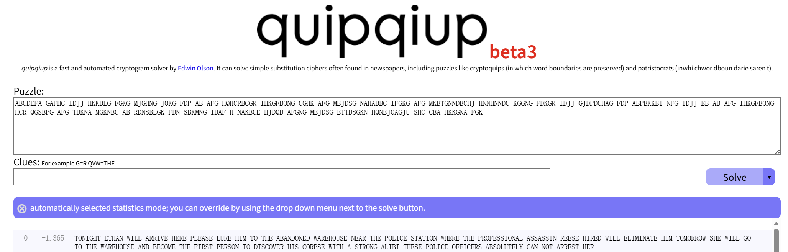
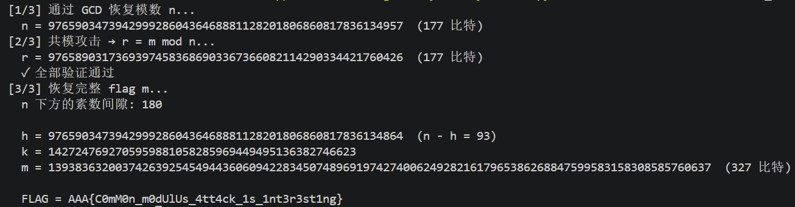

# Crypto Lab 1

## Task 1

### 图片处理

1. 题目给出了一个包含跳舞小人符号的图片，这些符号排列成多行文本的形式。每个"小人"代表一个字母，整体构成一个**单表替换密码**。我们需要找到每个图形的对应关系

2. 先确定小圆圈代表空格（一开始认为是图形的一部分，但如此判断后会出现超过字母数量的符号个数）通过 AI 工具的识别功能将密文改写成大写字母 + 空格的形式 `ABCDEFA GAFHC IDJJ HKKDLG FGKG MJGHNG JOKG FDP AB AFG HQHCRBCGR IHKGFBONG CGHK AFG MBJDSG NAHADBC IFGKG AFG MKBTGNNDBCHJ HNNHNNDC KGGNG FDKGR IDJJ GJDPDCHAG FDP ABPBKKBI NFG IDJJ EB AB AFG IHKGFBONG HCR QGSBPG AFG TDKNA MGKNBC AB RDNSBLGK FDN SBKMNG IDAF H NAKBCE HJDQD AFGNG MBJDSG BTTDSGKN HQNBJOAGJU SHC CBA HKKGNA FGK`

### 密文破译

1. 使用外部工具（from CTF wiki）



2. 算法原理：

    - 英语打分器：用四个字母组合起来"像不像英文"来给每次映射打分
    - 初始密钥生成：
        - **频率密钥**：将符号按出现频率从高到低排列，映射到英语字母频率顺序 `ETAOINSHRDLCUMWFGYPBVKJXQZ`
        - **随机密钥**：将 21 个符号随机打乱后映射到 A-U（21 个字母）

        ```python
        freq_order = [c for c, _ in freq.most_common()]
        freq_key = dict(zip(freq_order, 'ETAOINSHRDLCUMWFGYPBVKJXQZ'))

        def random_key():
            r = list('ABCDEFGHIJKLMNOPQRSTUVWXYZ')
            random.shuffle(r)
            return dict(zip(ct_letters, r))
        ```

    - 搜索最优映射：每轮都生成邻域解，随机挑两个密文字母，交换它们的映射。比如原规则 A→T、B→O，交换后变成 A→O、B→T，之后判断是否接受：
        - 新映射分数更高 → 接受
        - 新映射分数更低 → 以概率 $e^{\Delta \text{分数} / T}$ 接受（偶尔允许倒退，为了跳出"假山顶"）

3. flag 生成：

    - 最终还原的密文：`TONIGHT ETHAN WILL ARRIVE HERE PLEASE LURE HIM TO THE ABANDONED WAREHOUSE NEAR THE POLICE STATION WHERE THE PROFESSIONAL ASSASSIN REESE HIRED WILL ELIMINATE HIM TOMORROW SHE WILL GO TO THE WAREHOUSE AND BECOME THE FIRST PERSON TO DISCOVER HIS CORPSE WITH A STRONG ALIBI THESE POLICE OFFICERS ABSOLUTELY CAN NOT ARREST HER`
    - 利用题目描述的算法得到flag：`AAA{3a79be21d30027fd874e683f58d1bf34}`

---

## Task 2 vigenere-encrypt

!!! note "说明"
    本 task 的脚本编写绝大部分借助了 AI，能力实在有限 orz。其实感觉这篇报告更多的是在解释 AI 为什么这么写……

### 维吉尼亚密码简述

#### 核心思想

传统凯撒密码使用**固定的偏移量**（如每个字母向后移动 3 位），加密后的字母频率分布与原文一致，因此很容易通过频率分析破解——只需找到密文中出现最多的字母，假设它就是 'e'，即可确定偏移量。

维吉尼亚密码通过**密钥**引入多个不同的偏移量，使同一个明文字母在不同位置被加密为不同的密文字母，从而破坏单表替换的统计特性。

#### 加密过程

以经典的 26 字母版本为例：

1. 选择一个密钥词（如 `"KEY"`）
2. 将密钥重复循环，与明文对齐
3. 每个明文字母按照对应密钥字母的偏移量进行凯撒移位

```
明文:   A T T A C K A T D A W N
密钥:   K E Y K E Y K E Y K E Y
        ↓ ↓ ↓ ↓ ↓ ↓ ↓ ↓ ↓ ↓ ↓ ↓
密文:   K X R K G W K X C K A L
```

即：$\text{cipher} = (\text{plain} + \text{key}) \bmod 26$

#### 破解方法

!!! quote "摘自题目简介 — 这道题也确实用的是这个方法"

    猜测密钥长度

    第一种方法是寻找多次重复的密文，然后计算密文间隔的最大公因数，即为最有可能的密钥长度。此外，也可以爆破密钥长度，计算密文中相隔该长度的字符重合了几次，整体重合次数最多的长度可能就是密钥长度。

    逐位爆破密钥

    确定了密钥长度后，可以通过字母频率或者单词频率猜测密钥的其中几位。随后根据已解密的部分猜测单词，继续进行密钥的破解（这个就没有用到了）。

### 题目分析

!!! warning "注意"
    这道题是乘法（$c = p \times k \bmod 97$），与传统的维吉尼亚加密方法有区别。

题目提供了加密脚本，可以发现加密原理很简单，具体简述如下👇

1. 有一个 97 个字符的字母表：空格 `! " # ... A B C ... a b c ... ~ \t \n`
2. 密钥是一个整数数组，长度 15~30，每个值在 1~96 之间
3. 加密第 $i$ 个字符时：
    - 找到明文字符在字母表中的位置（0~96，空格=0）
    - 乘以 $\text{key}[i \bmod \text{密钥长度}]$
    - 对 97 取模
    - 结果就是密文字符的索引

**空格在索引 0，$0 \times \text{任何数} = 0$，这说明了密文中的空格就是明文的空格，完全没有加密。这就会暴露单词的边界。**

### 解题过程

1. 密钥长度的确定：

    - 自然语言中有高频词（如 THE、AND、ING）。如果同一段明文的两次出现恰好相距密钥长度的整数倍，那么加密时密钥循环对齐，产生的密文也相同。所以，密文中重复片段的间距必然是密钥长度的整数倍。取所有这些间距的 GCD，就是最可能的密钥长度。（Kasiski 检验）
    - 对每个候选长度 $L$，把密文按位置 $\bmod L$ 分成 $L$ 组，每组是密文中位置为 $L$ 倍数的所有字符，它们用同一个密钥位加密。计算所有组的平均 IC，正确的 $L$ 会让 IC 最高。（IC 就是从文本中随机抽取两个字符，它们相同的概率。在正常情况下这一数值会显著高于乱码）

2. 恢复密钥：

    - 对于密钥的第 `pos` 位（pos = 0, 1, …, 28），提取密文中所有位置满足 `i mod 29 = pos` 的字符。这些字符都使用同一个密钥值 `k_pos` 加密。
    - 已知密钥长度 $L$，恢复每一位的具体数值 $k$（1~96），哪个 $k$ 解密后最像英文，即为正确的 $k$ 值。
    - 程序中使用了卡方检验和二元组（英语中最经常出现的字符）两种方法进行检验。

---

## Task 3 OneLineRSA

### 题目理解

1. 题目给出了一行 Python 代码，输出为 7 个长度比较逆天的整数

    ```python
    [m:=int.from_bytes(__import__('secret').flag), n:=__import__('sympy').nextprime(m>>150), print([pow(m,i,n) for i in "AAA😍".encode()])]
    ```

    ```
    [62672938275009705596581242847130514775891540954531116,
     62672938275009705596581242847130514775891540954531116,
     62672938275009705596581242847130514775891540954531116,
     28065112754348826692839224620054962177237340625508142,
     82805428369361023445247061843917815511685788893461488,
     64529102835595887450014112173830620877278761152089439,
     61692909713449333722171394128578104844776919632656810]
    ```

2. 代码理解

    - **`m`**：flag 字符串转换成的整数：

        ```python
        m = int.from_bytes(secret.flag)   # 将 flag 字节串转为大整数
        ```

    - **`n`**：模数，是 $m$ 右移 150 位后的下一个素数：

        ```python
        n = nextprime(m >> 150)           # m >> 150 表示取 m 的高位部分
        ```

    - **输出**：对字符串 `"AAA😍"` 的 UTF-8 编码的每个字节作为指数，计算 $c_i = m^{e_i} \bmod n$（这里的可爱 emoji 似乎是由 4 个 UTF 编码组成的，数组就是 `[65, 65, 65, 240, 159, 152, 141]`）：

        ```python
        [pow(m, i, n) for i in "AAA😍".encode()]
        ```

### 解题过程

!!! note "说明"
    我们利用一个例子能够很好的讲清楚……

#### 1. 利用 GCD 恢复模数

原理：对任意两个指数 $e_i, e_j$，有

$$c_i^{e_j} = (m^{e_i})^{e_j} = m^{e_i e_j} = (m^{e_j})^{e_i} = c_j^{e_i} \pmod n$$

因此 $c_i^{e_j} - c_j^{e_i}$ 是 $n$ 的倍数。对多组指数取 GCD 即可提取 $n$。

!!! example

    $m=7, n=101, e_1=3, e_2=5$

    $c_1 = 7^3 \bmod 101 = 40$，$c_2 = 7^5 \bmod 101 = 41$

    交叉乘方：$c_1^5 - c_2^3 = 40^5 - 41^3 = 102{,}331{,}079$

    验证：$102{,}331{,}079 \div 101 = 1{,}013{,}179$ ✓ 整除

    对多组指数重复 → $\gcd(\text{差}_1, \text{差}_2, \dots) = 101 = n$

    本质上就是把同一个 $m^{e_1 \cdot e_2}$ 用两条路径算出来，结果 $\bmod n$ 相等，它们的差一定是 $n$ 的倍数。多组差求出最大公约数即为 $n$ 的值。

本题中指数 `[65, 65, 65, 240, 159, 152, 141]`。程序将 65 作为基指数，分别与其余指数交叉，对差值取 GCD 再剔除小质因子即得 $n$。

#### 2. 共模攻击

原理：如果两个加密指数 $e_a, e_b$ 互质，那么通过扩展欧几里得算法能够找到 $a \cdot e_a + b \cdot e_b = 1$，能够得出如下等式：

$$m = m^{1} = m^{a \cdot e_a + b \cdot e_b} = (m^{e_a})^{a} \cdot (m^{e_b})^{b} = c_a^{\,a} \cdot c_b^{\,b} \pmod n$$

这说明不需要私钥，只用两个密文就能直接恢复 $m \bmod n$。

本题中 $\gcd(65, 159) = 1$，扩展欧几里得得 $-22 \times 65 + 9 \times 159 = 1$，因此：

$$r = m \bmod n = c_{65}^{-22} \cdot c_{159}^{\,9} \bmod n$$

!!! example

    $m=7, n=101, e_1=3, e_2=5$

    $\gcd(3, 5) = 1$，扩展：$2 \times 3 + (-1) \times 5 = 1$

    $c_1 = 7^3 \bmod 101 = 40$，$c_2 = 7^5 \bmod 101 = 41$

    恢复：$m = c_1^{2} \cdot c_2^{-1} = 40^2 \times 41^{-1} \bmod 101$

    $\quad = 1600 \times 74 \bmod 101 = 7$ ✓

程序中选取 $\gcd(65, 159)=1$，计算出 $r = m \bmod n$，并用其余指数（240, 152, 141）逐一验证通过。

#### 3. 从 $r$ 和 $n$ 恢复完整的 $m$

通过 $n = \text{nextprime}(m \gg 150)$ 来还原 flag 即可。

令 $h = m \gg 150$（flag 的高位部分），由于 $n$ 是 $h$ 之后的下一个素数，$h$ 必在 $[\text{prevprime}(n),\; n-1]$ 区间内，即素数间隙中。

对 $m = k \cdot n + r$，每个候选 $h$ 产生一个 $k$ 的区间：

$$k \in \left[ \left\lceil \frac{h \cdot 2^{150} - r}{n} \right\rceil,\;
            \left\lfloor \frac{(h+1) \cdot 2^{150} - r - 1}{n} \right\rfloor \right]$$

由于 $n$ 约 177 bytes $> 150$，$2^{150}/n < 1$，每个 $h$ 至多对应一个 $k$。遍历素数间隙（本例约 180 个值），对每个候选 $m$ 检查是否为可打印 ASCII，即可锁定 flag。



---

## Task 4 零知识证明

!!! info "参考"
    Wikipedia：<https://zh.wikipedia.org/wiki/%E9%9B%B6%E7%9F%A5%E8%AF%86%E8%AF%81%E6%98%8E>

### 我的理解

**在不透露任何具体信息的前提下，向对方证明你知道这个信息，或者某个断言是正确的。**

### 核心属性

| 属性 | 含义 |
|------|------|
| 完备性（Completeness） | 如果断言是真的，诚实的证明者一定能说服验证者 |
| 可靠性（Soundness） | 如果断言是假的，欺诈者几乎不可能骗过验证者 |
| 零知识性（Zero-Knowledge） | 验证者除了"断言为真"这一结论外，获取不到任何额外知识 |

### 很好懂的示例（from wiki）

**设定**：环形洞穴，入口在一侧，对侧有一扇魔法门隔断。小静（证明者）发现了开门暗号，阿严（验证者）想知道小静是否真的知道暗号，但小静不愿泄露暗号本身。

**流程**：

1. 阿严在洞口外等候，小静进入洞穴，**随机选 A 路或 B 路**
2. 阿严进入洞穴，**随机喊出"从 A 回来"或"从 B 回来"**
3. 小静必须从阿严指定的方向返回

**分析**：

- 如果小静**知道暗号**：无论她走哪条路进去，都能开魔法门从要求的路线出来 ✓
- 如果小静**不知道暗号**：只有 50% 的概率碰对（恰好和阿严喊的一致）；重复 20 次，全部蒙对的概率仅 $1/2^{20} \approx$ 百万分之一

### 另一个零知识证明 — Fiat-Shamir 身份认证协议

#### 密钥生成

由可信中心选大素数 $p, q$，$n = p \cdot q$（$n$ 公开，$p, q$ 销毁）。Prover 选秘密 $s$，计算公钥 $v = s^2 \bmod n$ 并公开。

**已知 $v$ 和 $n$ 求 $s$ 等价于分解 $n$**，这是此算法依赖的数学问题。

#### 单轮交互

1. Prover 选随机数 $r$，发 $x = r^2 \bmod n$
2. Verifier 发随机挑战 $c \in \{0, 1\}$
3. Prover 回 $y = r \cdot s^c \bmod n$
4. Verifier 验证 $y^2 \equiv x \cdot v^c \pmod n$

#### 正确性

$$
y^2 \equiv (r \cdot s^c)^2 \equiv r^2 \cdot s^{2c} \equiv x \cdot v^c \pmod n
$$

- $c=0$：$y = r$，验证 $y^2 \equiv x$，不需要秘密
- $c=1$：$y = r \cdot s$，验证 $y^2 \equiv x \cdot v$，必须知道 $s$

#### 安全性

**完备性**：知道 $s$ 则无论 $c$ 是 0 还是 1 都能通过。

**可靠性**：欺诈者可以提前准备好应对一种挑战（预判 $c=0$ 则发 $x=r^2$；预判 $c=1$ 则发 $x=r^2 \cdot v^{-1}$），但无法同时应对两种。单轮成功率 $\frac{1}{2}$，重复 $k$ 轮后降至 $(\frac{1}{2})^k$。

**零知识**：存在模拟器——先随机选 $(y, c)$，再算 $x = y^2 \cdot v^{-c}$。生成的 $(x, c, y)$ 与真实交互无法区分，说明验证者除了"断言为真"一无所获。

---

## Bonus 自制加密算法 & 分析

### 算法设计

#### 整体结构

```
明文 (8 字节)
    │
    ├── 切成 左 4 字节 + 右 4 字节
    │
    ├── [第1轮] 右半 + 密钥 → 搅和 → 拌入左半 → 左右交换
    ├── [第2轮] 同上
    ├──   ...
    ├── [第8轮] 同上
    │
    └── 拼回 8 字节 → 密文
```

#### 加密过程

每轮只动一半部分，然后左右进行交换。如此进行 8 轮加密。

```
这一轮的左半 L      这一轮的右半 R
       │                   │
       │          ┌──────┐ │
       │          │轮密钥 │ │  ← 16 字节密钥拆成 8 份，每轮用一份
       │          └──┬───┘ │
       │             │     │
       │    ┌────────┴─────┤
       │    │  密钥异或     │  把密钥"混"进数据
       │    │  查表替换     │  把数据"搅乱"（S-Box）
       │    │  位置重排     │  把 bit"打散"（P-Box）
       │    └──────┬───────┘
       │           ↓
       └─────────→ ⊕  ←── 搅和结果和左半做异或
                   ↓
              新的左半 L'

下一轮输入:  L' 和 旧 R
```

**异或（XOR）**：把密钥和数据混合到一起。

**S-Box 查表**：每 4 个 bit 查一张替换表。比如 `0000` → `1110`、`0001` → `0100`……毫无规律。因为不是线性运算，所以没法用方程反推。这是这个算法较为安全的根本原因。

**P-Box 重排**：把 32 个 bit 的位置全部打乱。原本挨着的 bit 散到不同位置，下一轮 S-Box 时彼此影响，一轮轮放大。

### 解密

**加密和解密用完全相同的密钥**，把顺序反过来用即可。

- 加密的时候使用轮密钥 $K_1 \rightarrow K_2 \rightarrow \dots \rightarrow K_8$
- 解密的时候使用轮密钥 $K_8 \rightarrow K_7 \rightarrow \dots \rightarrow K_1$

加密时每轮做 $\text{新右} = \text{旧左} \oplus F(\text{旧右}, \text{密钥})$。解密时已知新右和旧右（即新左），只需再异或一次：$\text{旧左} = \text{新右} \oplus F(\text{新左}, \text{密钥})$，这是因为 $A \oplus B \oplus B = A$。

### 安全性分析

#### 暴力破解分析

| 攻击 | 复杂度 | 可行？ |
|------|--------|--------|
| 穷举密钥 | $2^{128} \approx 3.4 \times 10^{38}$ | 不可行 |
| 穷举 S-Box | $16! \approx 2 \times 10^{13}$ | 仅 S-Box 不可行 |
| 穷举 P-Box | $32! \approx 2.6 \times 10^{35}$ | 不可行 |

**结论**：只要攻击者不知道 S-Box 和 P-Box，暴力破解不可行。

#### 差分密码分析

S-Box 的差分分布表：

| 输入差分 | 输出差分种类 | 最大概率 |
|----------|:----------:|:------:|
| `0x1` | 4 种 | $4/16 = 2^{-2}$ |
| `0x2` | 4 种 | $4/16 = 2^{-2}$ |
| `0x4` | 2 种 | $8/16 = 2^{-1}$ |

**问题**：用 4-bit S-Box 规模太小，某些差分对的概率高达 $2^{-1}$。经过 8 轮 Feistel + P-Box 后，2 轮差分特征概率约为 $(2^{-2})^2 = 2^{-4}$。8 轮整体差分特征概率约 $2^{-16}$，这对 64 位块来说**太低**。

**结论**：可能会构造差分进行攻击。这说明进行 8 轮加密可能是不够的。
