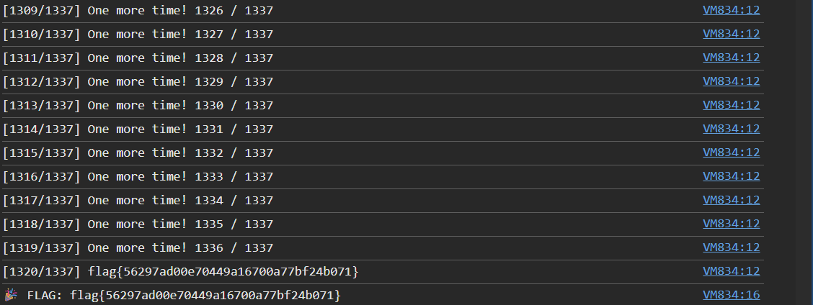
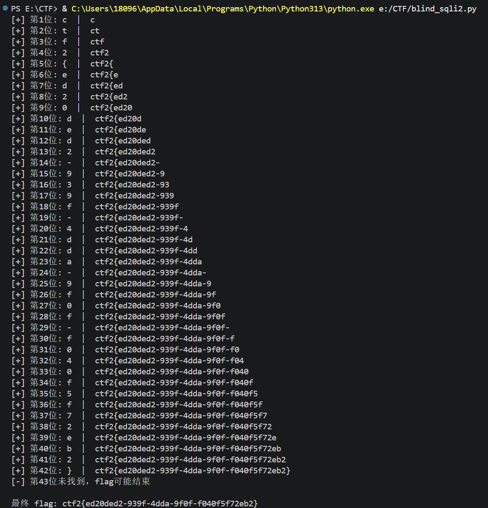
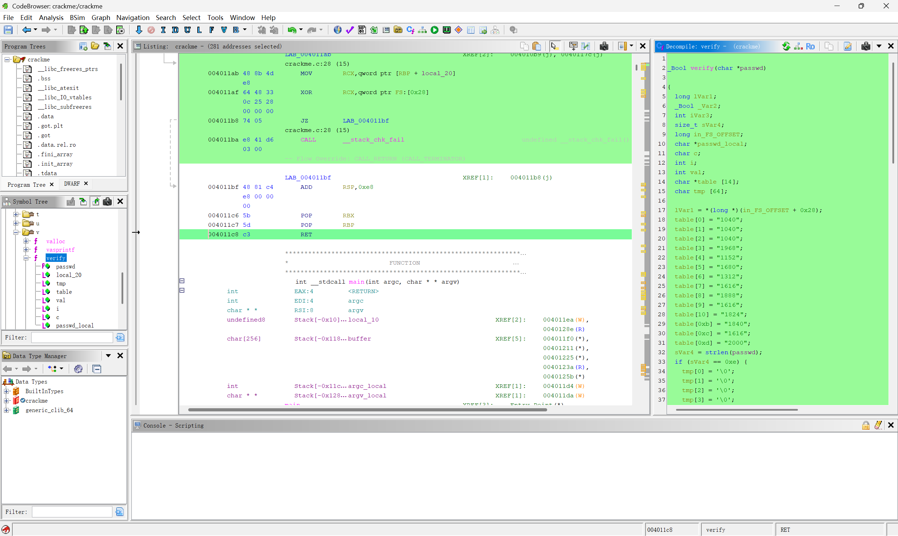
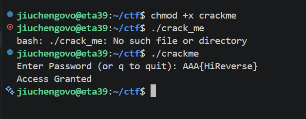

# Misc Lab 1

## Task 1 — Calculator

1. 文件分析
    - (.lua是一种轻量级，嵌入式的脚本语言)
    - 观察文件可以发现有一些空行，用 `cat -A` 命令可以查看（`cat -A` 会在段尾加 `$`，Tab 会显示为 `^I`）
    - 说明本题在正常的 Lua 计算器代码末尾，用空格和 Tab 拼出了 flag 的二进制编码（空格代表 0，Tab 代表 1）

    

2. 脚本撰写
    - 用二进制模式“rb”读取，可以用来保留所有原始字节
    - 观察上一张 cat -A 的结果可以发现是每隔一行有一行有效输入
    - 表示为二进制再转成十进制，用ASCII码转化就可以得到具体的flag了
    - 具体的代码实现可以看 py 代码里的注释

    

## Task 2 — Fixpoint

> Base64 编码原理应该不用再写了吧…… lab0写过了qwq

1. 前置知识
    - 首先可以观察到一个现象：对某个字符串反复进行 Base64 编码时，越前面的字符会越先稳定（如 `Vm0wd2QyUXlVWGxWV0d4V1YwZDRWMVl3WkR……`）
    - 原理很简单，分析第一个字符 `V`：Base64 编码将输入字符串转为二进制（0-255），然后除以 4 按照 Base64 映射表获得新字符
    - `V` 的 ASCII 码值是 86，`86 / 4 = 21`，而 21 对应的 Base64 映射也是 `V`！所以一旦到 `V`，就永远被锁死了
    - 根据数学归纳法可知后面字符也会逐渐锁死

2. 解题思路
    - 给了我们一个 1000 字符的稳定前缀，可以确定由其中的前 750 字符 Base64 编码而来（使用自定义映射）
    - 在 750 个输入字节中取 250 组，拆成 4 个 6-bit 索引，这些索引就是映射表的索引
    - 示例：`Nsl → 78 115 108 → 01001110 01110011 01101100 → 010011 100111 001101 101100 → 19 39 13 44 → NslS`（箭头就是映射！）
    - 最后插入题目提示 `FiXed p01nT` 即可

    

## Task 3 — Slow Login

1. 自动化攻击脚本（从端口依次递增判断）

    

2. 正常 & 异常的请求

    
    

    - 基于时间的盲注 SQL 注入（Web lab 1 有做过）：

        ```sql
        username=admin' AND IF(LENGTH((SELECT secret_value FROM secret_store LIMIT 1))>32, SLEEP(0.8), 0)-- -
        ```

    - 过滤器设置：`http and frame.time_delta > 0.7` 会显示延迟超过 0.7 秒的 HTTP 包（SLEEP 触发的请求），说明条件被满足
    - 如果 `http and frame.time_delta < 0.7` 则说明条件未被满足

    

3. 请求分析
    - 随便点开一个包，URL 解码后得到：
        ```sql
        username=admin' AND IF(ASCII(SUBSTRING((SELECT secret_value FROM secret_store LIMIT 1),4,1))>66, SLEEP(0.8), 0)-- -
        ```
    - 即判断第四个字符的 ASCII 码值是否大于 66，条件为真则延迟 > 0.7s

4. 解题方法
    - PCAP 解析 → HTTP 请求/响应配对 → 提取 SQL 注入条件 & 计算延迟 → 二分查找恢复 Flag

> 这道题的代码自己实在写不出来，借助了 AI（大部分） 我太菜了 TwT



## Task 4 — Live and Let Die

### 4.1 前置知识

1. **ICMP（Internet Control Message Protocol，互联网控制报文协议）**
    - TCP/IP 协议栈中的网络层协议，主要用于网络设备之间传递诊断和控制信息
    - 不像 TCP/UDP 那样传输应用数据，而是报告网络状态（ping 命令就是典型的 ICMP 应用）
    - 主要功能：确认 IP 包是否成功到达目标地址，以及通知发送过程中 IP 包被丢弃的原因

2. **ICMP 报文格式**
    - ICMP 报文包含在 IP 数据报中，IP 报头在 ICMP 报文的最前面
    - 一个 ICMP 报文包括：IP 报头（至少 20 字节）、ICMP 报头（至少 8 字节）和 ICMP 报文数据部分
    - 当 IP 报头中的协议字段值为 1 时，说明这是一个 ICMP 报文

3. **TTL（Time To Live）**
    - 用于限制 IP 数据包在网络中存在时间的字段，防止数据包无限循环
    - IPv4 报头中的 8 位字段，位于第 9 个字节，最大值 255，推荐值 64
    - 每经过一个路由器 TTL 减 1，减到 0 时路由器丢弃数据包并发送 ICMP 超时消息

### 4.2 解题流程

1. 将 pcap 文件放进 Wireshark，发现全都是 ICMP，打开 Internet Control Message Protocol 首选项

    

2. 可以发现部分 TTL 是异常的（不是 63 或 64），使用 `icmp.type == 8 and ip.ttl != 64` 过滤出携带信息的 TTL

    

3. 对 TTL 数值进行 ASCII 转码即可得到最终的 flag！

    

> 依旧用 AI 协助完成了本题代码…… 但是其实这道题直接自己硬看也不是很困难 ww


