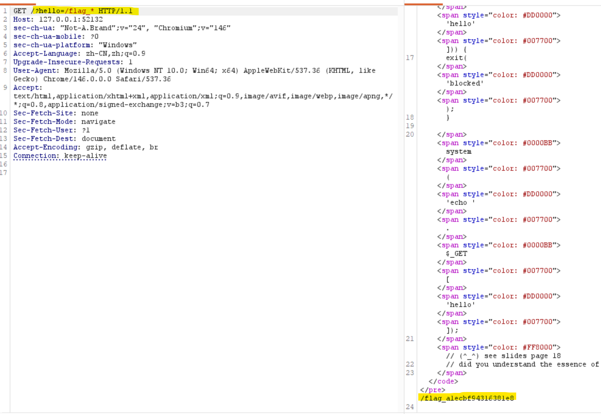
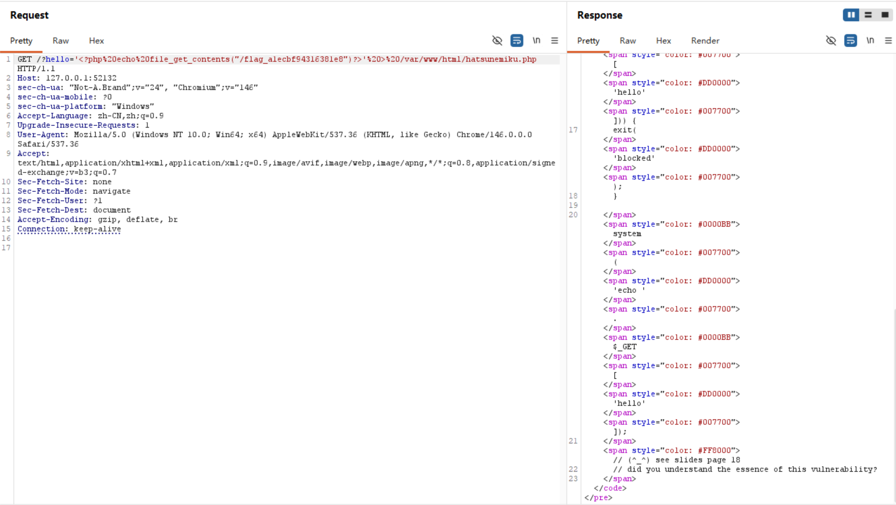
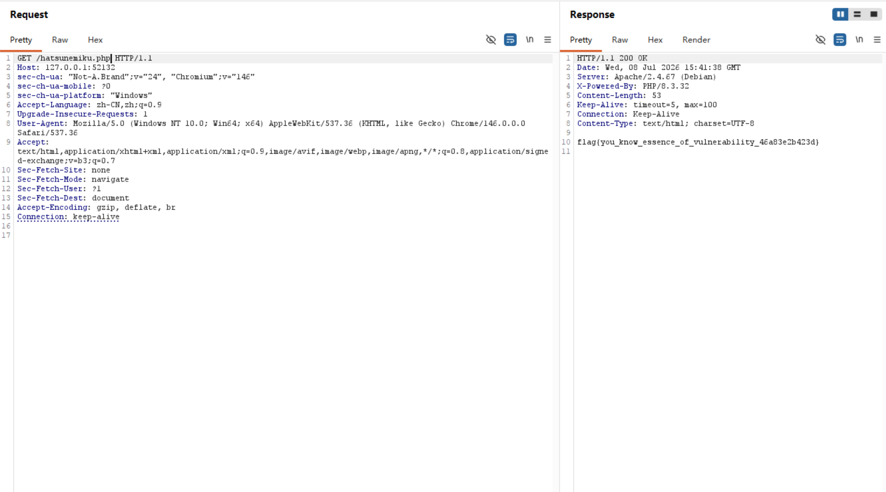
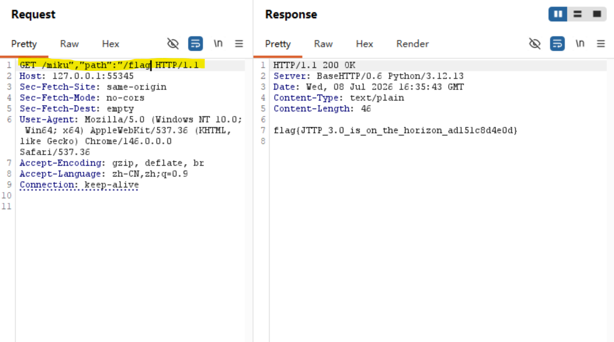
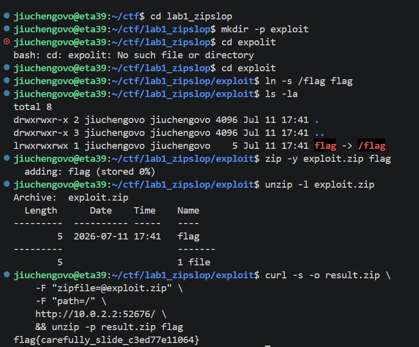

# Lab 1：Web

## Task 1
> Shell 就是 Linux 的命令解释器 可以认为其本身就是一种脚本语言


**在php里写下`system("echo hello")`的时候发生了什么？**

1. php发出请求，将后面的字符串交给shell，shell克隆出一个新进程（Fork）并将其变成一个真正的shell解释器（exec）

2. shell开始解释并执行
    - Lexer：将这个短句分成两个部分“echo”和“hello”
    - Parser：判断哪些是命令，哪些是参数
    - **Expansion**
        - 变量扩展（Variable Expansion）**$ 符号**。例如执行echo $USER时会换成user名字，例如用户名是root就改成`echo root`。
        - 命令替换扩展（Command Substitution）：识别 \$(...) 或反引号 `...`。Shell 会递归开一个子 Shell 先执行括号内的命令。如 echo \$(whoami) $\rightarrow$ 内部先运行 whoami 得到结果 $\rightarrow$ 替换为 echo root。
        - 通配符扩展：例如`echo *.txt`变为`echo a.txt`

3. Execution（后端执行与重定向阶段）
    - 经过 Expansion 替换完成后，命令正式进入执行期：
    - 重定向拦截（Redirection）：执行器如果在线路中发现了 > 或 >> 符号，会立刻改变输出方向。它不通知屏幕，而是调用内核在指定路径（如 /var/www/html/）创建或打开目标文件，将后续的输出流直接绑定到该文件上。
    - 命令运行：
        - 如果是内建命令（如 echo, cd）：Shell 自己直接在当前进程内部消化执行。
        - 如果是外部命令（如 cat, ls）：Shell 会再次 fork 一个子进程去硬盘里找到对应的二进制程序来运行。
        
4. 下面就是这道题的解题过程👇 用到的就是上面的知识点








## Task2
> 需要知道的知识大概就是一些前后端的基础知识，但是我从来没看具体看过前后端的代码所以很痛苦qwq
> 如果熟练的话感觉这道题很简单捏
> 思考都写在注释里面了！
```python
import json
import os
import socket
from http.server import BaseHTTPRequestHandler, ThreadingHTTPServer
from urllib.parse import unquote, urlsplit


PORT = int(os.getenv("PORT", "80"))
BACKEND = ("127.0.0.1", int(os.getenv("BACKEND_PORT", "9000")))


class Handler(BaseHTTPRequestHandler):
    protocol_version = "HTTP/1.1"

    def do_GET(self):
        # unquote用来解码URL中的百分号编码字符，urlsplit用来解析URL，这行代码把路径切了出来，如果没有路径就默认是"/"
        path = unquote(urlsplit(self.path).path or "/")
        # 如果路径是/flag就返回403禁止访问
        if path == "/flag":
            self.reply(403, "blocked\n")
            return

        # 这行代码把请求头转成字符串，格式是"key: value"，每个请求头占一行
        headers = unquote("\\n".join(f"{k}: {v}" for k, v in self.headers.items()))
        # 这行代码构造请求体，包含请求方法、路径和请求头
        # 注意这里注意这里注意这里！！！
        # 这个json的组装方式是直接把用户输入的path和headers拼接到json字符串里，没有做任何过滤和转义
        # 而且json格式是右覆盖左，所以可以在path里再叠一个path！
        # 这样我们就得到了flag！真是易如反掌啊（）
        req = '{"method":"GET","path":"{path}","headers":"{headers}"}\n'
        # 这行代码把请求体中的占位符替换成实际的路径和请求头，并编码成字节串
        req = req.replace("{path}", path).replace("{headers}", headers).encode()

        f = self.backend()
        # 把JSON发给后端
        f.write(req)
        f.flush()

        try:
            # 从后端读取响应，解析成JSON对象
            resp = json.loads(f.readline())
            self.reply(resp["status"], resp["body"])
        except Exception:
            self.reply(502, "bad backend\n")
            self.close_connection = True
```

```python
class Handler(socketserver.StreamRequestHandler):
    def handle(self):
        for line in self.rfile:
            try:
                req = json.loads(line)
                # 这段代码检查请求是否是GET方法，并且路径是字符串类型，如果不是就抛出异常
                if req.get("method") != "GET" or not isinstance(req.get("path"), str):
                    raise ValueError
                # 如果请求路径是/flag，就读取FLAG文件的内容，否则就返回echo: {path}
                body = open(FLAG).read() if req["path"] == "/flag" else f"echo: {req['path']}\n"
                status = 200
            except Exception:
                status, body = 400, "bad JTTP\n"

            self.wfile.write(json.dumps({"status": status, "body": body}).encode() + b"\n")

```



## Task 3

### 什么是zip_slip?
- Zip Slip是一种路径穿越漏洞，发生在程序解压 ZIP 文件时，没有对 ZIP 内部条目的文件名做安全检查。
- **核心原理**: ZIP 条目里存的是相对路径文件名。攻击者可以把文件名写成包含 ../ 的形式：
    - 正常文件:  `report.txt  →  /tmp/extract/report.txt` 
    - 恶意文件:  `../../etc/passwd  →  /etc/passwd`
如果解压程序不做过滤，文件就会被写到解压目标目录之外的任意位置，实现任意文件写入。
- 符号链接
    - 语法：ln -s <目标路径> <链接名>
    - `zip -y` 程序看到符号链接时，不跳转，只把链接本身（路径字符串）当作数据
    - `zip` 程序跟随链接，服务器打包的时候调用调用 readlink("flag") 得到 "/flag" → 打开 /flag 读取真实内容 → 把 flag{xxxxxxxx} 作为普通文件内容写入 archive.zip


### 这道题的想法
1. 代码分析
```python
# 很明显这里只检验了 extra_path 参数是否等于 /flag 但 ZIP 文件内部的内容完全不检查！
extra_path = normalized_path(request.form.get("path"))
    if extra_path == "/flag" or os.path.realpath(extra_path) == "/flag":
        return page("/flag is blocked", 400)

    work = Path(tempfile.mkdtemp(prefix="zip-slop-"))
    try:
        upload_zip = work / "upload.zip"
        tmp = work / "tmp"
        archive = work / "archive.zip"
        tmp.mkdir()
        upload.save(upload_zip)
```
`result = run(f"unzip -q {shlex.quote(str(upload_zip))} -d {shlex.quote(str(tmp))}")` zip会跟随符号链接读取真实文件内容！
所以上传一个包含 flag → /flag 符号链接的 ZIP，让服务器解压→重新打包，zip 会跟随符号链接把 /flag 内容偷出来。

2. 部分流程
> 其实在截图里就能看出来了，这里选一些比较关键的

- Hacker
    - ln -s /flag flag ← 创建符号链接
    - zip -y exploit.zip flag ← -y: 保留符号链接，不跟随

- 服务器
    - unzip exploit.zip -d tmp/ → tmp/flag 被恢复为符号链接 → /flag
    - path="/"，跳过复制步骤
    - zip -qr archive.zip . → zip 跟随符号链接 flag → /flag → 读取 /flag 真实内容打包



## Task 4(这里并不在作业要求范围内，但是ZJU::CTF上有题所以也记录在这里)

> 课上讲了远程所以我在远程上试了好多时间…… 但是发现可能并不需要

```php
copy(string $source, string $dest): bool
```
- 两个参数，都是字符串。把 $source 文件的内容复制到 $dest，成功返回 true，失败返回false。
- 源可以是相对路径，绝对路径，路径穿越`../flag`，远程URL
- 写 -- 把读到的内容写到这个路径（路径必须存在！copy不能创建目录）

解题流程👇

`?file=/flag` -> `/backup/flag`