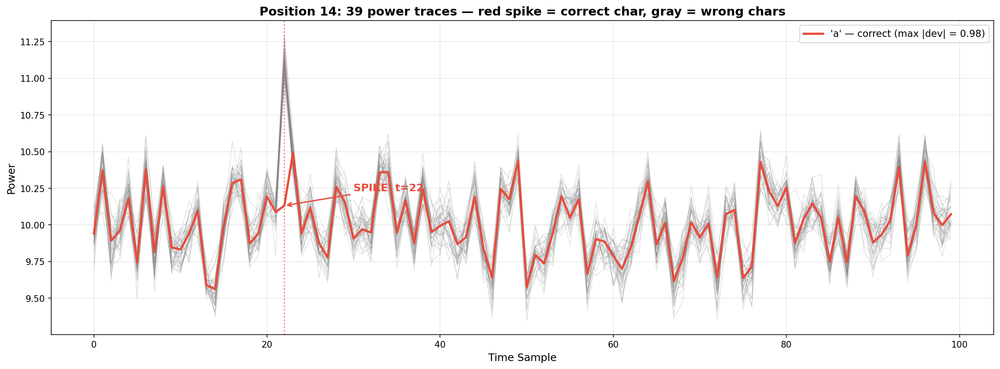

# Misc Lab 3

## Task 1：songmingti

### 背景知识

#### JPEG 文件结构

JPEG 文件以 **SOI (Start of Image)** 标记 `FF D8` 开头，以 **EOI (End of Image)** 标记 `FF D9` 结尾。绝大多数图片查看器和解析库只读取 SOI → EOI 之间的数据，**EOI 之后的内容会被直接忽略**。因此只要我们在结束标记之后再加入一些内容，就可以实现隐写


### 解题步骤

#### 1. 初步分析

用 `file` 命令查看文件基本信息：

```bash
file "songmingti.jpg"
# 输出: JPEG image data, JFIF standard 1.01, 450x300
```

第一张图片直接打开即可看到 **前半段 flag**。

#### 2. 发现隐藏数据

> 其实直接丢进stegsolve这样的图片分析工具也可以，在这里记录一下python代码写法

用 Python 检查 JPEG 文件结构，寻找文件尾标记（EOF marker `FF D9`）之后是否还有额外数据：

```python
with open("songmingti (1).jpg", "rb") as f:
    data = f.read()

eof = b"\xff\xd9"
pos = data.find(eof)
after = data[pos + 2:]
print(f"Data after JPEG EOF: {len(after)} bytes")
# 输出: Data after JPEG EOF: 39003 bytes
```

发现在 `FF D9` 之后还有约 39KB 的额外数据，且开头为 `FF D8`（JPEG 文件头 SOI marker），说明这是一个**完整隐藏的 JPEG 图片**。

#### 3. 提取隐藏图片

```python
with open("songmingti (1).jpg", "rb") as f:
    data = f.read()

eof = b"\xff\xd9"
pos = data.find(eof)
second_jpg = data[pos + 2:]

with open("hidden.jpg", "wb") as f:
    f.write(second_jpg)
```

打开提取出的 `hidden.jpg`，即可看到 **后半段 flag**。


#### 4. 拼接获得完整 Flag

将两张图片中的 flag 拼接：`AAA{the_true_fans_fans_nmb_-1s!}`，这样我们就得到了最终的flag


## Task 2：Find the Spot

> 最简单的一集 感动 TwT

### 解题步骤

1. 识图：将照片放进百度识图，可以发现这是临沂服务区

2. 寻找不同角度的图片（我是在高德地图和小红书的打卡图片里找到的）

flag：flag{520精品集合店_儿童游玩需有家长陪同}

---

## Task 3：EZStego

> 代码部分有 AI 的帮助

### 前置知识

> 参考了 wiki 上的介绍

#### PLTE Chunk 格式

PNG 文件由多个 chunk 组成，其中 **PLTE (Palette) chunk** 用于索引色图像（颜色类型 3）。格式如下：

| 字段 | 长度 | 说明 |
|------|------|------|
| Length | 4 bytes | 数据长度 = 颜色数 × 3 |
| Chunk Type | 4 bytes | `"PLTE"` |
| Palette Data | N bytes | 每 3 字节一组 RGB (R,G,B)，共 N/3 种颜色 |
| CRC | 4 bytes | 校验和 |

调色板最多包含 256 种颜色（768 字节），每种颜色 24 bit（RGB 各 8 bit）。

#### EZStego 隐写原理

EZStego 由 Romana Machado 设计，是最早的 PNG 调色板隐写算法之一。核心思路如下：

1. **排序调色板**：将 PLTE 中的所有颜色按**亮度 (Luminance)** 排序，亮度公式 $L = 0.299R + 0.587G + 0.114B$。排序后相邻的颜色对人眼几乎无法区分
2. **嵌入秘密数据**（编码过程）：遍历每个像素，获取其调色板索引，在亮度排序序列中找到该颜色的位置 $pos$，检查 $pos$ 的 LSB 是否匹配要嵌入的秘密比特。如果不匹配，将像素索引改为 $pos \oplus 1$（与相邻颜色交换）。因为相邻颜色几乎相同，视觉上无差异
3. **提取秘密数据**（解码过程）：按亮度排序调色板，对每个像素找到其颜色在排序序列中的位置，该位置的 **LSB** 即是隐藏的 1 bit，按光栅顺序收集所有比特并转换为字节


### 解题步骤

#### 1. 分析图像

```python
from PIL import Image
img = Image.open("palette.png")
print(img.mode)   # 'P' — 调色板模式
print(img.size)   # (800, 369)
```

- 图像为 **P 模式**（索引色），800 × 369 像素
- 包含 256 色调色板
- 所有像素数据都是调色板索引（0–255）

#### 2. 按亮度排序调色板

```python
palette = img.getpalette()
colors = []
for i in range(256):
    r, g, b = palette[i*3], palette[i*3+1], palette[i*3+2]
    luminance = 0.299 * r + 0.587 * g + 0.114 * b
    colors.append((i, luminance))

sorted_by_lum = sorted(colors, key=lambda x: x[1])
# 映射: 原始索引 → 亮度排序位置
index_to_pos = {orig_idx: pos for pos, (orig_idx, _) in enumerate(sorted_by_lum)}
```

#### 3. 提取 LSB 比特

```python
import numpy as np
pixels = np.array(img)

bits = []
for row in range(pixels.shape[0]):
    for col in range(pixels.shape[1]):
        pixel_idx = pixels[row, col]
        sorted_pos = index_to_pos[pixel_idx]
        bits.append(sorted_pos & 1)  # 取 LSB
```

`800 × 369 = 295,200` 个像素 → `295,200` bit → 最终一共得到 `36,900` 字节的隐藏数据。

#### 4. 转换为字节并提取 Flag

```python
data = bytearray()
for i in range(0, len(bits) - 7, 8):
    byte = 0
    for j in range(8):
        byte = (byte << 1) | bits[i + j]
    data.append(byte)

# 搜索 flag 模式
import re
text = ''.join(chr(b) if 32 <= b < 127 else '.' for b in data)
for match in re.finditer(r'[A-Z]{3,}\{[^}]+\}', text):
    print(f"Flag: {match.group()}")
```

### 完整解题代码

```python
from PIL import Image
import numpy as np
import re

# 读取图像
img = Image.open('palette.png')
palette = img.getpalette()

# 按亮度排序调色板
colors = []
for i in range(256):
    r, g, b = palette[i*3], palette[i*3+1], palette[i*3+2]
    lum = 0.299 * r + 0.587 * g + 0.114 * b
    colors.append((i, lum))
sorted_by_lum = sorted(colors, key=lambda x: x[1])
index_to_pos = {orig: pos for pos, (orig, _) in enumerate(sorted_by_lum)}

# 提取所有像素的 LSB
pixels = np.array(img)
bits = []
for row in range(pixels.shape[0]):
    for col in range(pixels.shape[1]):
        bits.append(index_to_pos[pixels[row, col]] & 1)

# 比特转字节
data = bytearray()
for i in range(0, len(bits) - 7, 8):
    byte = sum(bits[i + j] << (7 - j) for j in range(8))
    data.append(byte)

# 搜索 flag
text = ''.join(chr(b) if 32 <= b < 127 else '.' for b in data)
for match in re.finditer(r'[A-Z]{3,}\{[^}]+\}', text):
    print(f"Flag: {match.group()}")
```


## Task 4：Time & Power — 侧信道功率分析

> **Flag** : `0ops{power_1s_a11_y0u_n55d}`

### 前置知识

#### 侧信道攻击简介

**侧信道攻击** 是一种通过分析系统的物理实现（而非算法本身的数学弱点）来获取秘密信息的攻击方法。常见侧信道包括：

| 类型 | 泄漏源 | 分析对象 |
|------|--------|----------|
| 功耗分析（Power Analysis） | CMOS 电路开关功耗 | 电流/功率轨迹 |
| 时序分析（Timing Analysis） | 操作执行时间差异 | 响应延迟 |
| 电磁分析（EM Analysis） | 电磁辐射 | 电磁波形 |
| 缓存攻击（Cache Attack） | CPU 缓存命中/未命中 | 访问时间 |

#### 简单功耗分析（SPA）

**简单功耗分析（Simple Power Analysis, SPA）** 是指攻击者直接观察设备在执行加密操作时的功耗轨迹，从中提取秘密信息。

**原理**

- 在密码逐位比对过程中，设备会逐个字符进行比较
- 若**字符正确**：设备继续比较下一位 → 产生额外计算 → 功率轨迹出现**异常尖峰**
- 若**字符错误**：设备停止比较 → 功率轨迹保持正常

因此，正确字符的功率轨迹会在**某个特定时间点**出现明显偏离（尖峰/谷值），而在其他时间点与错误字符的轨迹相似。基于这一原理，我们可以通过找出每个位置上**单点偏离最大**的轨迹来识别正确字符。

### 解题步骤

#### 1. 理解数据结构

首先加载 `.npz` 文件查看数据结构：

```python
import numpy as np
data = np.load('data.npz')
print(data.keys())  # ['input', 'input_id', 'power']
```

数据包含三个数组：

| 数组 | 维度 | 说明 |
|------|------|------|
| `input` | (1053,) | 1053 个单字符（a-z, 0-9, `_`, `{`, `}`），每个字符被尝试了 27 次 |
| `input_id` | (1053,) | 整数 0-26，标识当前测试的是 flag 的第几个位置 |
| `power` | (1053, 100) | 功率轨迹矩阵，每条轨迹 100 个采样点 |

**数据组织方式：**

- 共 **27** 个 flag 位置（`input_id` 0-26）
- 每个位置尝试了 **39** 个候选字符（a-z, 0-9, `_`, `{`, `}`）
- 39 × 27 = **1053** 条功率轨迹，每条轨迹 **100** 个采样点

#### 2. 攻击方法：单点最大偏离

> 参考了题目简介里提到的那道题的writeup

正确字符的功耗特征是**在单个采样点出现极端尖峰**，而错误字符的轨迹在各采样点都围绕中位数波动。因此，对每个 flag 位置：

1. 计算该位置所有 39 条轨迹在每个采样点的**中位数**，作为"正常"基准
2. 对每条轨迹，计算其与中位数之差的**最大绝对值**（即最极端偏离的那个采样点）
3. 最大绝对值最大的那条轨迹对应的字符，就是正确字符

```python
median = np.median(pos_power, axis=0)          # 每个采样点的中位数
diffs = pos_power - median                      # 每条轨迹与中位数的差
max_abs_diff = np.max(np.abs(diffs), axis=1)    # 每条轨迹的单点最大偏离
best_idx = np.argmax(max_abs_diff)              # 偏离最大的轨迹 = 正确字符
```


#### 3. 功率轨迹可视化

对每个 flag 位置的 39 条功率轨迹进行可视化，可以直观地观察正确字符（红色）在某采样点处的**异常尖峰**：



### 完整解题代码

```python
import numpy as np

data = np.load('data.npz')
inputs = data['input']
power = data['power']

n_positions = 27    # flag 长度
chars_per_pos = 39  # 每个位置尝试的字符数

flag = ''
for pos in range(n_positions):
    start = pos * chars_per_pos
    end = start + chars_per_pos
    pos_power = power[start:end]
    pos_chars = inputs[start:end]

    # 单点最大偏离法：正确字符在某个采样点有极端尖峰
    median = np.median(pos_power, axis=0)
    diffs = pos_power - median
    max_abs_diff = np.max(np.abs(diffs), axis=1)
    best_idx = np.argmax(max_abs_diff)
    flag += pos_chars[best_idx]

print(f'Flag: {flag}')
# 输出: 0ops{power_1s_a11_y0u_n55d}
```

## Bonus Feedback

假期比较空闲，所以每个专题的课基本都去听了。Misc 的两次专题课听起来很好理解，我也很感兴趣，能一直听下去！作业也比较友好，两个 Bonus 题目借助了一点 AI，但我基本能完全理解 AI 在做什么以及它对知识点的解释，不像某些专题那样让人两眼一抹黑（
建议的话……其实没什么建议！现在课的形式已经很完美了 qwq。如果非要说的话，作业或许可以在临近 DDL 的时候放出一些 hint～

## 附录：用到的一些工具 or 命令

| 工具/命令 | 用途 |
|-----------|------|
| `file <filename>` | 查看文件类型 |
| `xxd <filename> \| tail -20` | 查看文件末尾的十六进制 |
| `strings <filename>` | 提取可打印字符串 |
| `binwalk <filename>` | 检测文件中的嵌套文件 |
| `binwalk -e <filename>` | 自动提取嵌套文件 |
| `exiftool <filename>` | 查看图片/文件的元数据 |
| `zsteg <filename>` | 检测 PNG/BMP 的 LSB 隐写 |
| `steghide info <filename>` | 查看 steghide 隐藏信息 |
| `stegsolve` | 图像隐写综合分析（GUI 工具） |
