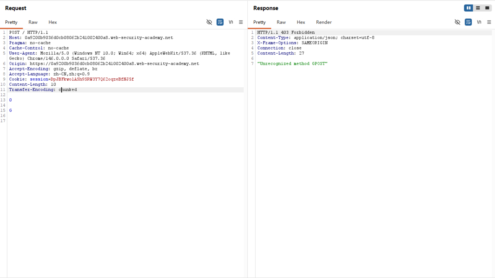
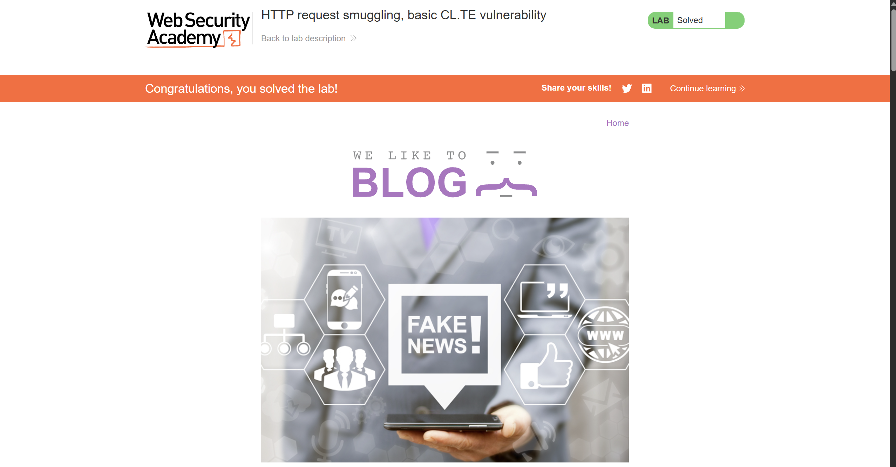

# Web Lab 1 : 计算机网络基础

## 网络基础

### Task1

>先看一个例子 👇

``` plaintext
PS C:\Users\18096\Desktop> nslookup www.zju.edu.cn
Server:  UnKnown
Address:  10.10.0.*

Non-authoritative answer:
Name:    www.zju.edu.cn
Address:  10.203.4.*

PS C:\Users\18096\Desktop> nslookup www.zju.edu.cn
Server:  UnKnown
Address:  10.161.220.*

Non-authoritative answer:
Name:    www.zju.edu.cn.queniusa.com
Addresses:  2409:8c34:4400:1000:43::11
          2409:8c34:4400:1000:43::10
          112.48.*.51
          112.48.*.52
          112.48.*.53
          112.48.*.54
          112.48.*.55
          112.48.*.56
          112.48.*.57
          112.48.*.50
Aliases:  www.zju.edu.cn
          www.zju.edu.cn.w.cdngslb.com
```
> 为什么会出现这种区别？
#### 了解一些知识

1. 网络层：IP地址，子网掩码，路由
    - IP 设备唯一的数字地址
    - 子网掩码 分割IP这串长数字，区别网络地址or主机地址
    - 路由 决定数据包如何在不同网络之间传输（规划路线）

2. 应用层：DNS和域名解析 HTTP/HTTPS协议
    - DNS(域名系统) 将人类可读的域名转换为IP地址，以便于计算机定位特定的服务器
    - 域名解析：本地DNS缓存（如果没有） -> 请求DNS服务器
    - HTTP：请求 + 响应结构 请求包括请求方法/请求URL/请求头/请求体 响应包括状态码/响应头/响应体
    - HTTPS：HTTP的加密版本，通过加密数据传输/身份验证/数据完整性检验保护数据

3. 传输层：端口 TCP/UDP
    - 端口：”计算机上的门”，通向不同的应用程序或服务
    - TCP是面向连接的，可靠性高，适用于需要可靠数据传输的应用
    - UDP是面向无连接的，传输速度快，适用于实时性要求较高的应用

4. 网络接口层：信号具体的传输方式？（这个不太理解 后续补上）

#### 所以我们可以这样解释
> 在局域网环境下，由内网 DNS 服务器（10.10.0.x）直接解析出浙大核心服务器的内网私有 IP（10.203.4.x）。
> 在切换为公网蜂窝流量后，网络接口层发生改变，电脑向公网 DNS（10.161.220.x）发起请求。结果触发了域名别名（Aliases）机制，指向了 CDN 广域网负载均衡系统，最终返回了 10 个用于分流的公网 IPv4（112.48.x.x）及 IPv6 地址。
> 值得注意的是，流量状态下最终返回的公网IPV4不同时间完全不同（动态机制）

### Task2

#### 页面加载的完整流程
> 当我们打开浏览器并查到成绩，背后经历了的流程：

1. 用户登录与身份颁发：
用户在浏览器输入学号密码。浏览器通过 Ajax 请求将加密后的凭证发给教务处服务器。服务器验证通过后，在响应中颁发一个独一无二的身份令牌（即 Cookie 中的 JSESSIONID），并保存在用户的浏览器本地。

2. 前端页面架构加载：
登录成功后，浏览器自动跳转到成绩查询主页。此时服务器返回的是一个网页框架（HTML/CSS）。这个阶段页面往往是空的，或者只有一个“查询”按钮和表格的表头，并没有具体的成绩数据。

3. 数据异步触发：
用户在页面上选择“2025-2026学年”，点击“查询”按钮。这个动作触发了网页后台的 JavaScript 脚本。脚本在不刷新整个网页的情况下，带着用户的 Cookie 和查询参数（如学年、页码），悄悄向后台专一的数据接口发送了一个 POST 请求。

4. 动态渲染展示：
教务处后台数据接口收到请求，校验 Cookie 确认身份后，从数据库读取该学生的成绩，打包成干净的 JSON 格式数据返回。前端 JavaScript 脚本收到这串 JSON 后，把里面的分数动态填进网页的表格里，用户最终看到了成绩。

#### 如何找到返回关键信息的接口和参数
> 在面对海量的网络数据包时，我们通过Burp Suite定位：

1. 抓取HTTP History：
    - 在点击“查询”按钮的前后，让代理工具处于工作状态，完整记录下这期间浏览器发出的所有 HTTP/HTTPS 请求。
    - 锁定关键字：重点观察 MIME type 为 JSON 或 XHR（异步请求）的行。在 URL 路径中寻找包含 cj（成绩拼音）、cjcx（成绩查询）、score、query 等和成绩高度相关的特征关键字。

2. 比对响应体（Response Verification）：
逐个点击疑似的请求，查看它们的 Response 内容。如果某个请求的响应体中出现了明显的指示（如“xf”、“jd”、“4.5”），说明这个 URL 就是我们要找的关键数据接口。

3. 提取请求头与请求体参数：
    - 提取 Headers：在该请求的 Request 区域，复制出维持登录状态的 Cookie、防止跨站攻击的 _csrf 以及标识浏览器身份的 User-Agent。
    - 提取 Data：在该请求的最底部（如果是 POST），提取出诸如 queryModel.currentPage=1、queryModel.showCount=15 等表单参数。这些参数暴露了前端是如何告诉后端“我要看第几页、看多少条”的逻辑，也是我们在 Python 中写翻页循环的依据。

```
import requests
import json
import time  # 引入时间库，用于控制访问频率

url = "https://zdbk.zju.edu.cn/jwglxt/cxdy/xscjcx_cxXscjIndex.html?doType=query&gnmkdm=N5083&su=3250102349"

headers = {
    "Host": "zdbk.zju.edu.cn",
    "Sec-Ch-Ua-Platform": '"Windows"',
    "Accept-Language": "zh-CN,zh;q=0.9",
    "X-Requested-With": "XMLHttpRequest",
    "User-Agent": "Mozilla/5.0 (Windows NT 10.0; Win64; x64) AppleWebKit/537.36 (KHTML, like Gecko) Chrome/146.0.0.0 Safari/537.36",
    "Accept": "application/json, text/javascript, */*; q=0.01",
    "Content-Type": "application/x-www-form-urlencoded;charset=UTF-8",
    "Origin": "https://zdbk.zju.edu.cn",
    "Referer": "https://zdbk.zju.edu.cn/jwglxt/cxdy/xscjcx_cxXscjIndex.html?gnmkdm=N5083&layout=default&su=3250102349",
    "Connection": "keep-alive",
    "Cookie": "JSESSIONID=D9BF26B2BBCB776359D36BEA31E7071B; JSESSIONID=3B006115A22F067C7C220EDCC6858DC7; route=78347236f96598ad781aede801673cbb; _csrf=S8mwplVi9KWoF2WQ0TlCeJfmU%2FzNk3bW3hoXPp%2BPe%2Bc%3D; _pv0=%2BgE9XtnsZ53JIAgJrDpxpZ9vOg9q61Ems3fjqojd25Bqn46aeziJwnRPykuYDXH1VkNnuShQZXqVj4zcAR%2Fkd%2BAnGH6ROoZpN3jj%2BzhXOQ%2FNQ3jYbVDEjoFn9EdLj%2F49uv%2BqKCBzadjI%2BZFP29Rybd7H6obNvxqV7CzrF1vyoWbnWTlnXLN0ufXWgvsBsmbmss7xyqPurpvI2RZP%2FkJ51h9vKhc8EB%2BocjU8J7%2BfG%2BQABcukselp2%2FHV20HXdStSRNVSR%2F0JRYIE7wf7nuT4xzD1i8lgQW88e%2BS%2BoOIayzRR2Tu69djyVtW1b7RGUjxue2Z0H1%2FGjM3nCvns2lfbl%2FqTyhugnFCC8iKWv7Z8u7pH95iPPYloPyZlwOPnwdK4C%2BsqJKTekKBv%2FSn%2BysDANB5jZ8gHtN%2Fg1uWwxlRsue8%3D; _pf0=Px93rNbNjb01DekYdK44LVqRst7wup36j8EOxS4Ovfo%3D; _pc0=TQvX4uuYnsR0uBo%2F4twXnp8IbjPdh015D99kta5Z8aFcW5gliT3EGiurmiv3rWcv; iPlanetDirectoryPro=tNlvKXAGztY5MNP7SPMYxhp8d7dJr5pyBN8nItw0%2FQCxY%2F9uplUB5NGhLlefa6MaVlH6ikuiDaVjmoMWNMFgqPuRqPJqU9BG31owxhWt%2FLhn8psmnvMM%2FJ4q9MEWqvKBHUZu8kU60iAaX403OVq3lb3bP91ltVT2i%2B5TNNBmYkgFAdGSNnLmpv24MkIY0ZVOkzbNvAlwZ1Nd%2Fz%2F8aVjoaku5N12bgxqnKV6xr1hJaoH%2Bx%2BT96KxUlvIfSYAuM2mFbLaV2kpXt2N25eAKgICV5kZAQ96LosrTiCvfTDGcR%2FBfWuIWqUuCswhCDcVivpmtv7JWxiaW5Vjs1BREH2uwM4%2FEnrEfLwI3yoCLs959qjg%3D"
}

# 基础表单数据
data = {
    "xn": "",
    "xq": "",
    "zscjl": "",
    "zscjr": "",
    "_search": "false",
    "nd": "1783316578701",
    "queryModel.showCount": "15",
    "queryModel.sortName": "xkkh",
    "queryModel.sortOrder": "asc",
    "time": "0"
    # 注意：这里拿掉了固定 currentPage，我们要在循环中动态赋值
}

page = 1
all_courses_count = 0

print("================ 自动翻页爬取成绩 ================")

while True:
    print(f"\n正在尝试抓取第 {page} 页...")
    
    # 动态更新当前页码（注意教务系统接收的是字符串格式）
    data["queryModel.currentPage"] = str(page)
    
    try:
        response = requests.post(url, headers=headers, data=data, timeout=10)
        result_json = response.json()
        
        # 获取当前页的课程列表
        items = result_json.get("items", [])
        
        # 判断 1：如果这一页没有返回任何课程数据，说明已经翻到头了
        if not items:
            print(f"第 {page} 页没有数据了，翻页结束。")
            break
            
        print(f"--- 第 {page} 页成绩单 ---")
        for item in items:
            kcmc = item.get("kcmc", "未知课程")
            cj = item.get("cj", "暂无")
            xf = item.get("xf", "0.0")
            jd = item.get("jd", "0.0")
            print(f"课程: {kcmc:<14} | 学分: {xf} | 绩点: {jd} | 成绩: {cj}")
            all_courses_count += 1
            
        # 判断 2：对比系统返回的总条数。如果已抓取条数 >= 系统总条数，也可以提前退出
        total_result = int(result_json.get("totalResult", 0))
        if all_courses_count >= total_result:
            print(f"\n已抓取全部数据（共 {all_courses_count}/{total_result} 条），正在退出...")
            break
            
        # 准备爬取下一页
        page += 1
        
        # 频率控制 每一页请求完，让程序“休息” 1 秒钟。
        time.sleep(1)

    except json.JSONDecodeError:
        print("解析 JSON 失败。可能 Cookie 已过期，或者受到了学校限制。")
        break
    except Exception as e:
        print(f"请求过程中发生错误: {e}")
        break

print(f"\n================ 爬取完成，共计 {all_courses_count} 门课程 ================")
```

### Task3

#### 了解一些知识
1. HTTP的请求体与请求头：
    - 首先要明确，请求体在语法格式上非常自由！但是，如果想要正确解析请求体，必须在请求头中包括Content-Type
    - 常见的Content-Type包括传统表单格式`application/x-www-form-urlencoded`（Lab中即为这种实现）
    - 现代API格式`application/json`
    - 多部分/文件上传格式`multipart/form-data`
2. 前端服务器的CL导向（Content-Length）与后端服务器的TE导向（Transfer-Encoding）
    - CL:请求头里直接写明请求体的字节长度。服务器数够了这么多字节，就认为这个请求结束了
    - TE:每一块的开头是这一块的十六进制长度。出现独立的数字0时代表整个请求结束

#### 我们怎样骗过了服务器？
1. 前端服务器接收到了Content-Length，判断字节数正确后认为这是一个完整的，合法的POST请求，将请求完整地转给了后端
2. 后端服务器则用chunked（分块）进行接收。
    - 看到了数字0，服务器认为没有更多分块了，读完两个回车之后宣布请求结束
    - **字母G**留在了缓冲区（Buffer）中，在下一次处理请求时出现了GPOST，即非法请求
    - 这样就完成了这个lab！


```
POST / HTTP/1.1
Host: 0a00008a04b73bb180dc8fe8009b00c4.web-security-academy.net
Pragma: no-cache
Cache-Control: no-cache
User-Agent: Mozilla/5.0 (Windows NT 10.0; Win64; x64) AppleWebKit/537.36 (KHTML, like Gecko) Chrome/146.0.0.0 Safari/537.36
Accept-Encoding: gzip, deflate, br
Accept-Language: zh-CN,zh;q=0.9
Cookie: session=tpZkWVcM7BXCXune0NkE7uUDyLZZKQ8J
Content-Type: application/x-www-form-urlencoded
Content-Length: 6
Transfer-Encoding: chunked

0

G
```



### Bonus
#### 漏洞成因：不安全的字符拼接
1. 在 Steam 上使用Smart2Pay充值时，整个流程belike：
    - 在 Steam 选择充值 20 元。
    - Steam 服务器在后台把你的交易信息（金额、订单号、你的邮箱）打包成一个字符串，并用一个密钥进行哈希签名，生成一个数字签名。
    - 这个签名用来向第三方支付公司（Smart2Pay）证明：“这个充值请求是 Steam 官方发出的，内容没有被篡改。”

2. 问题就出现在这里，Steam 生成签名的逻辑过于简单。
    - Steam 在进行哈希加密前，会把所有参数直接连成一长串纯文本(删除&，=等符号)，比如（简化一下）规则是：Amount + Email
    - 如果我把邮箱改成brixamount100abc@domain.com并发送充值2000的请求 生成字符串：`amount2000brixamount100abc@domain.com`
    - 在中间抓包，将amount=2000改成amount2=000 Email改成brix&amount=100&ab=c@domain.com 生成字符串`amount2000brixamount100abc@domain.com`
    - 发现了吗？二者完全一样！所以后者被判定为有效。它忽略了amount2这一“非法参数”，而转头去读取了邮箱中用&区分出的amount=100，因此只扣款100，steam里却充值了2000！