# Lab 1：Reverse

> 可能某些标题含人量不是很足因为我写到这个lab的时候已经没精力排版了 由AI进行markdown的排版 但是未标注AI的地方都是我自己写的


## Task 1.1

> 计算机好神奇……
> Task 1.1 就是把源代码逐步"翻译"成 CPU 能直接执行的机器指令的过程。


| 步骤 | 命令 | 产物 | 在干什么 |
|------|------|------|---------|
| 预处理 | `g++ -E -std=c++20 xx.cpp -o xx.i` | `xx.i` | 宏替换、头文件粘贴、删注释 |
| 编译 | `g++ -S -std=c++20 xx.cpp -o xx.s` | `xx.s` | C++ → 汇编语言 |
| 汇编 | `g++ -c -std=c++20 xx.cpp -o xx.o` | `xx.o` | 汇编 → 二进制机器码 |
| 链接 | `g++ -std=c++20 xx.cpp -o xx` | `xx` | 拼接库、填地址 → 可执行文件 |
| 运行 | `./xx` | — | 执行程序 |

!!! note "个人理解"
    - **预处理**：做"准备工作"，例如 `#include <iostream>` 会在这一步进行处理，即跑到系统目录里找 `iostream` 文件粘贴到文件里，宏展开，注释删掉，拼成一个极大的 C 代码（比如说我的 `.i` 文件有 36984 行）。
    - **编译（核心）**：将 C++ 代码编译成汇编语言。
    - **汇编**：将汇编里的 `mov`、`add`、`call` 等指令编译成 CPU 认识的 0 和 1，产出 `.o` 目标文件。
    - **链接**：但 `.o` 文件依旧不能执行——因为代码里调用了 `printf`、`cout` 等标准库函数，这些函数的代码不在文件里。编译器只知道"这里需要一个外部函数"，但不知道这个函数的真实内存地址。所以 `.o` 文件里这些地方是留空的，等于一张"地址待填写"的表格。链接器把 `.o` 文件和系统提供的标准库拼在一起，确定每个函数、每个全局变量在最终可执行文件里的绝对地址，把之前留空的地方都填补成真实的函数地址。然后就可以 `./` 执行了。

    !!! tip "关于待填充的内容"
        这里待填充的是非模板的声明，比如说初始化函数之类的较为底层的代码。像 `std::cout`、`upper_bound` 这种都是直接在预处理的时候粘贴进来的。

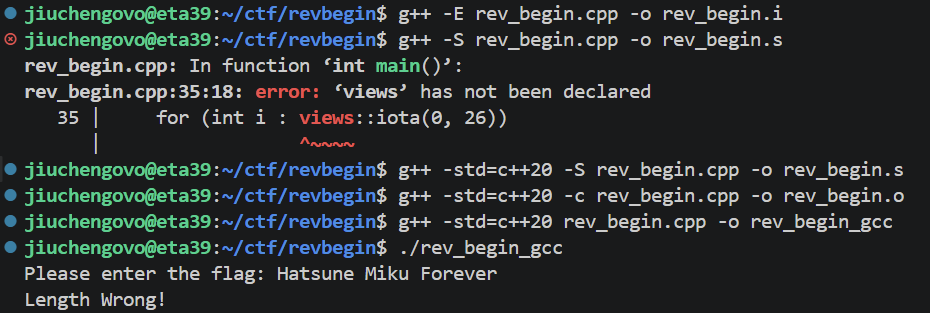


| 步骤 | 命令 | 产物 | 在干什么 |
|------|------|------|---------|
| LLVM IR 文本 | `clang++ -std=c++20 -S -emit-llvm xx.cpp -o xx.ll` | `xx.ll` | 生成文本格式的中间表示 |
| LLVM Bitcode | `clang++ -std=c++20 -c -emit-llvm xx.cpp -o xx.bc` | `xx.bc` | 生成二进制格式的中间表示 |
| 链接+运行 | `clang++ -std=c++20 xx.cpp -o xx && ./xx` | `xx` | 生成可执行文件并运行 |

Clang++ 会在中间经历 LLVM IR 的步骤。LLVM IR 是一种"中间语言"，优势在于**跨平台**。


```
gcc:    C++ → 汇编 → 机器码 → 可执行文件

clang:  C++ → LLVM IR → 汇编 → 机器码 → 可执行文件
                 ↑
             多出来这一层：跨平台优化和分析
```

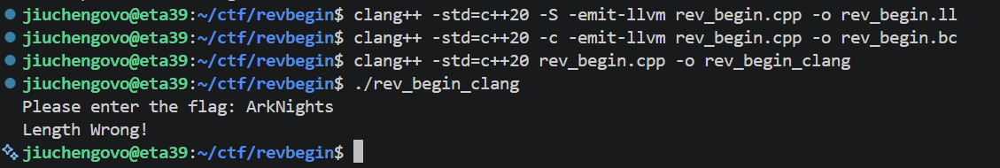

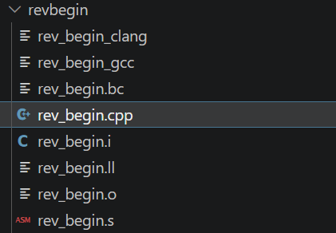

---

## Task 1.2 — 汇编与调试分析


逆推 flag 很简单，就按照 C++ 代码一步步逆回去就可以了。

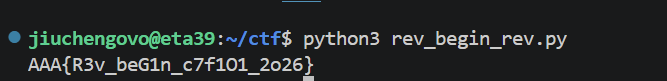


> 没学过汇编我是真的看不懂一点……大部分借助了 AI 来分析。

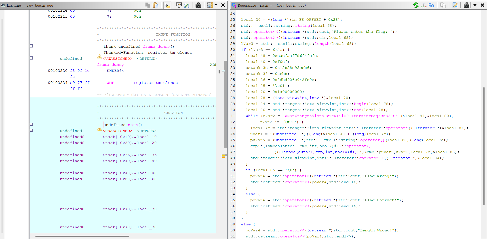 *gcc main*

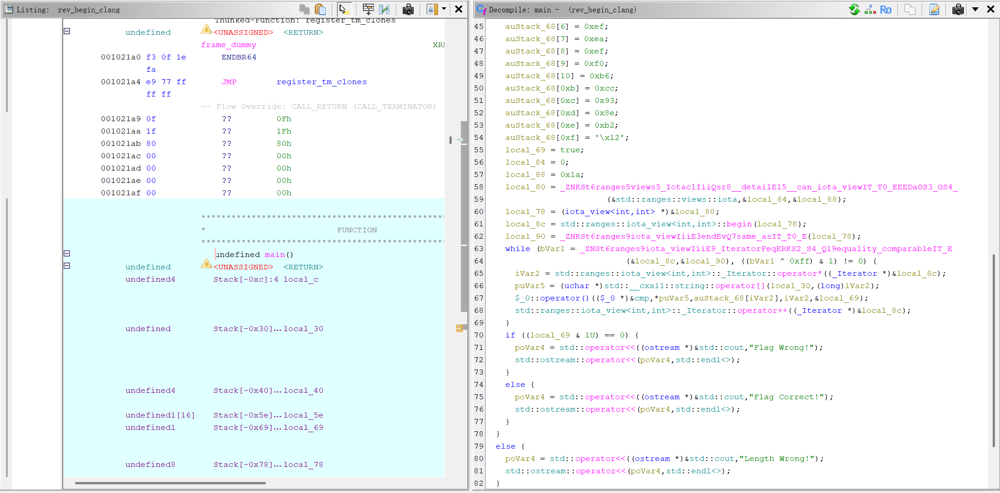 *clang main*

#### GCC 的 Lambda 实现

Lambda 被编译为独立的匿名类，并保留了源码中的变量名作为符号名。在 Ghidra 的 Symbol Tree 中搜索 `cmp` 就可以找到 `cmp::operator()` 函数，图片上就是这个函数。

```asm
LEA  RDI, [cmp]              ; 加载 lambda 对象地址
MOV  R8, RCX                 ; ok 引用（第4个参数）
MOV  ECX, EDX                ; i（第3个参数）
MOV  EDX, EBX                ; target[i]（第2个参数）
MOV  ESI, EAX                ; input[i]（第1个参数）
CALL cmp::{lambda}#1::operator()<unsigned char>
```

可以看出参数通过寄存器传递（`esi`、`edx`、`ecx`、`r8`）。

#### Clang 的 Lambda 实现

Lambda 也会被编译为独立匿名类，但符号名为编译器自动生成的 `$_0`（无意义的序号标识）。Ghidra 中搜索 `$_0` 才可以找到。

```asm
LEA  RDI, [$_0]              ; 加载匿名 lambda 对象地址
LEA  R8, [RBP-0x61]          ; ok 引用（第4个参数）
CALL $_0::operator()<unsigned char>
```

部分参数通过栈传递（`ok` 引用），这与上面的 GCC 的策略是不同的。

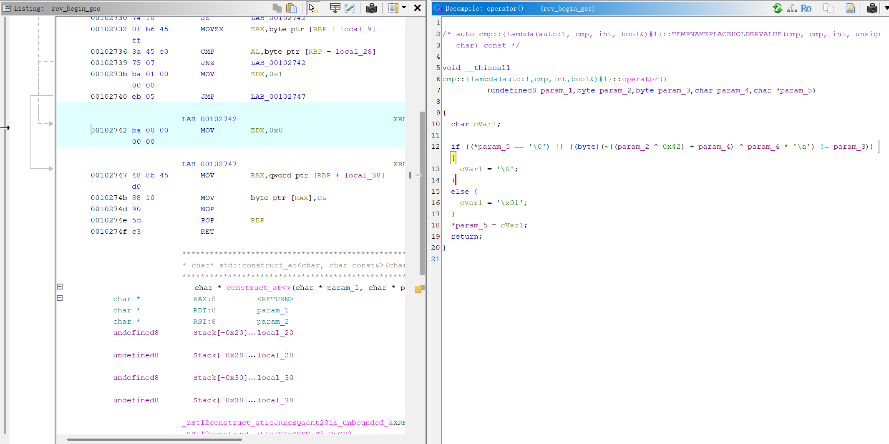 *gcc lambda*

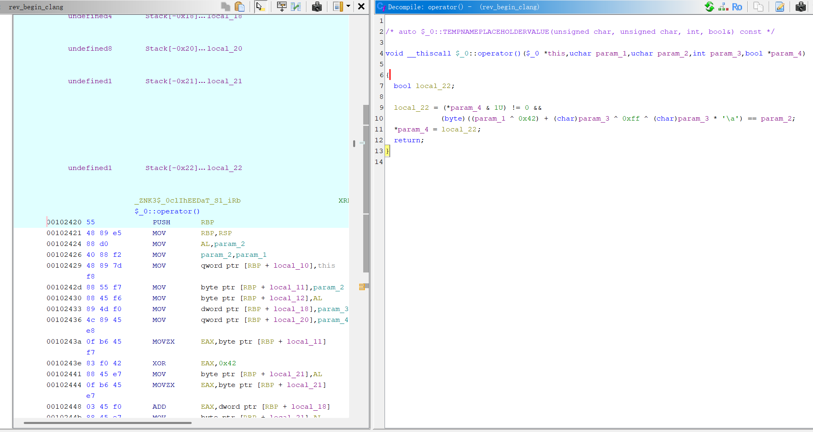 *clang lambda*


#### GCC 汇编实现（地址 `0x10233f`）

```asm
LEA  RAX, [RBP-0x7c]
MOV  RDI, RAX
CALL std::ranges::iota_view<int,int>::_Iterator::operator*   ; 取迭代器当前值
MOV  dword ptr [RBP+local_7c], EAX
MOV  EAX, dword ptr [RBP+local_7c]
CDQE
MOVZX EAX, byte ptr [RBP+RAX*0x1-0x40]                      ; 取 target[i]
MOVZX EBX, AL
MOV  EAX, dword ptr [RBP+local_7c]
MOVSXD RDX, EAX
LEA  RAX, [RBP-0x60]
MOV  RSI, RDX
MOV  RDI, RAX
CALL std::__cxx11::string::operator[]                        ; 取 input[i]
MOVZX EAX, byte ptr [RAX]
MOVZX EAX, AL
LEA  RCX, [RBP-0x7d]                                         ; ok 变量地址
MOV  EDX, dword ptr [RBP+local_7c]                           ; i
LEA  RDI, [cmp]                                               ; lambda 地址
MOV  R8, RCX                                                  ; ok 引用
MOV  ECX, EDX                                                 ; i
MOV  EDX, EBX                                                 ; target[i]
MOV  ESI, EAX                                                 ; input[i]
CALL cmp::operator()                                          ; 调 lambda
LEA  RAX, [RBP-0x7c]
MOV  RDI, RAX
CALL std::ranges::iota_view<int,int>::_Iterator::operator++ ; i++
```

#### Clang 汇编实现（地址 `0x10231a`）

```asm
LEA  RDI, [RBP-0x84]
LEA  RSI, [RBP-0x88]
CALL iota_view::_Iterator::operator==       ; 先比较迭代器（含 equality_comparable 约束）
; ... 比较逻辑 ...
LEA  RDI, [RBP-0x84]
CALL iota_view::_Iterator::operator*        ; 取迭代器当前值
MOV  dword ptr [RBP+local_94], EAX
MOVSXD RSI, dword ptr [RBP+local_94]
LEA  RDI, [RBP-0x28]
CALL string::operator[]                     ; 取 input[i]
MOV  qword ptr [RBP+local_c0], RAX
; ...
MOV  RAX, qword ptr [RBP+local_c0]
MOVZX ESI, byte ptr [RAX]
MOVSXD RAX, dword ptr [RBP+local_94]
MOV  ECX, EAX
MOVZX EDX, byte ptr [RBP+RAX*0x1-0x60]     ; 取 target[i]
LEA  RDI, [$_0]                             ; 匿名 lambda 地址
LEA  R8, [RBP-0x61]                         ; ok 引用
CALL $_0::operator()                        ; 调 lambda
; ...
LEA  RDI, [RBP-0x84]
CALL iota_view::_Iterator::operator++       ; i++
```

#### 对比总结

| 对比维度 | GCC | Clang |
|---------|-----|-------|
| 迭代器构造 | 直接调用 `begin()` / `end()` | 先通过工厂函数 `_Iota` 检查 `__can_iota_view` 类型约束 |
| `end()` 符号名 | `_IteratorFeqERKS2_S4_` | `_IteratorFeqERKS2_S4_Q19equality_comparableIT_E`（携带 concept 信息） |
| `operator==` 符号名 | 简洁 | 带 `Q7same_asIT_T0_E` 类型约束标记 |
| 优化程度 | 较少冗余指令 | 含大量 `eb 00`（`jmp $+2`）对齐填充，未开优化编译 |

!!! note "我的理解"
    GCC 在编译期将解释并丢弃掉约束信息，生成的符号名会更简洁。Clang 将这些约束信息保留在符号名中，即使编译完成后也可以通过符号名反推源码。此外 Clang 也多了一层 `_Iota` 函数作为 `iota_view` 的检查。

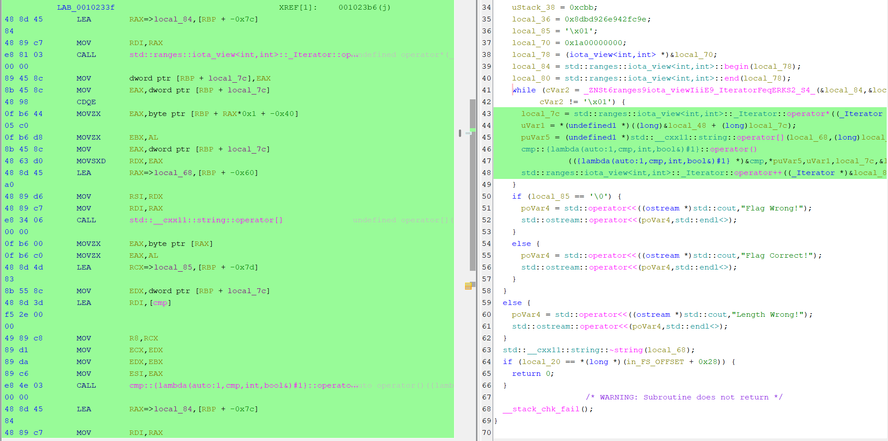 *gcc iota*

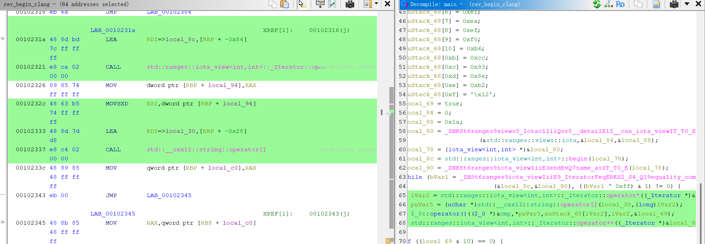 *clang iota 1*

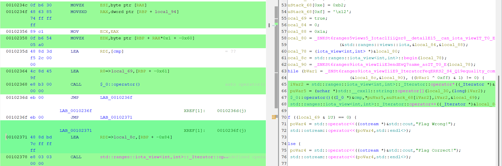 *clang iota 2*


#### 基础操作

加载程序、查看源码、设置断点：

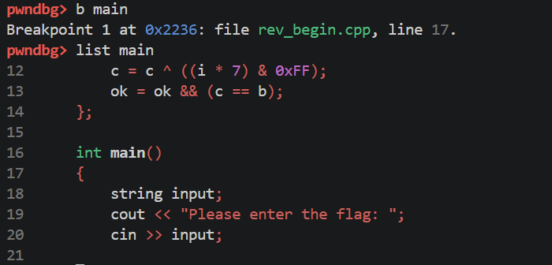

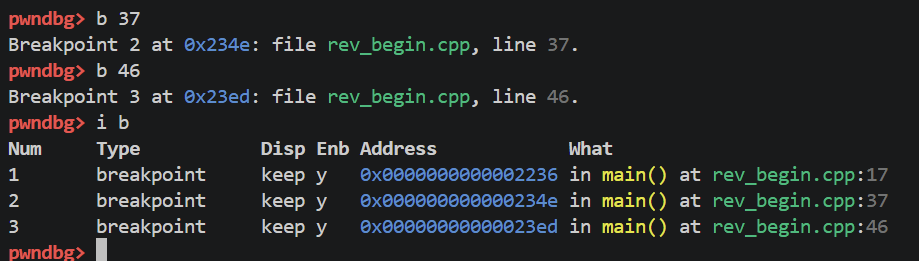

运行、单步执行：

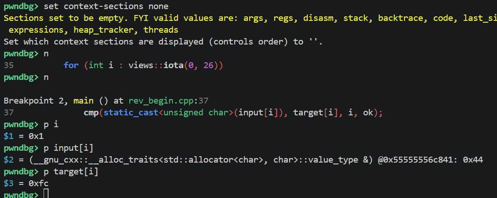

#### Lambda 函数动态分析

步入 lambda，查看参数：

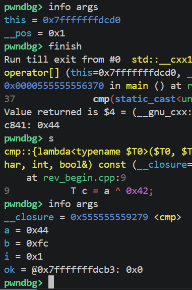

跟踪 `c` 值的变化：

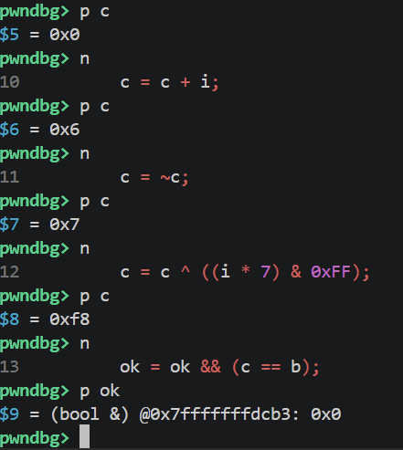

#### 常用命令速查

| 命令 | 作用 |
|------|------|
| `b N` | 在第 N 行设断点 |
| `r` | 运行程序 |
| `n` | 单步步过 |
| `s` | 单步步入 |
| `finish` | 跳出当前函数 |
| `p var` | 打印变量值 |
| `info args` | 查看当前函数参数 |
| `info locals` | 查看局部变量 |
| `i b` | 查看断点列表 |
| `disable N` | 禁用编号为 N 的断点 |
| `c` | 继续执行 |
| `q` | 退出 GDB |

---

## Task 2 — rev_more（Go 程序逆向）


该文件**未剥离符号（not stripped）**，Ghidra 能够直接显示出所有 Go 函数的原始名称。


程序读取了 `flag.txt` 这个文件：

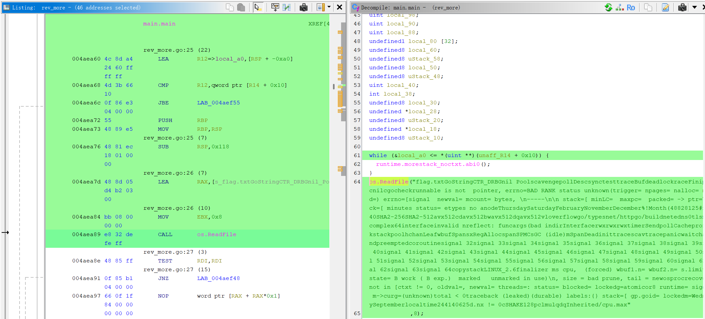

**长度校验**——长度必须能被 8 整除：

- `extraout_RBX == 0` → 文件为空 → panic
- `extraout_RBX & 7` → 按位与 7，等价于 `% 8`。不为 0 就是不能被 8 整除 → panic

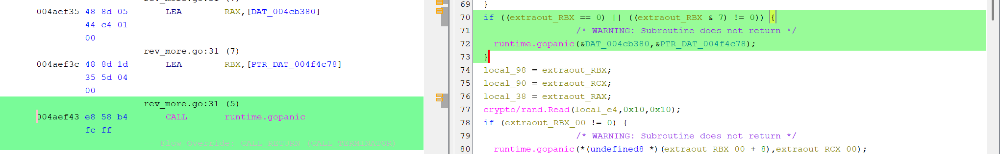

**密钥长度**——十六字节：

- `crypto/rand.Read(local_e4, 0x10, 0x10)`
- 第二个参数就是要读取的字节数

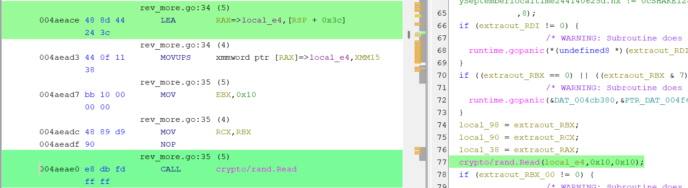


下面是关键的加密环节（结合 AI 辅助分析）：

```c
for (iVar6 = 0; iVar6 < 0x6f; iVar6 = iVar6 + 1) {
  //                 ^^^^^^
  //                 0x6F = 111 → 加密轮数

      // ============ 第一半：更新 v0 ============
      local_a8 = local_a8 + (
          // ^^^^^^^^ v0

          (local_c8[dVar11 & 3] + dVar11)
          //  ^^^^^^^^^^^^^^^^^^^^^^^^^^^
          //  key[sum & 3] + sum

          ^

          ((local_a4 >> 5 ^ local_a4 << 4) + local_a4)
          //  ^^^^^^^^^^^^^^^^^^^^^^^^^^^^^^^^^^^^^^
          //  ((v1 >> 5) ^ (v1 << 4)) + v1   ← XTEA 标志性操作！
      );

      // ============ Delta 累加 ============
      local_cc = dVar11 + 0x4a537f29;
      //         ^^^^^^   ^^^^^^^^^^
      //         sum      DELTA（自定义，不是标准 0x9E3779B9）

      // ============ 第二半：更新 v1 ============
      local_a4 = local_a4 + (
          // ^^^^^^^^ v1

          (dVar11 + local_c8[local_cc >> 0xb & 3] + 0x4a537f29)
          //                   ^^^^^^^^^^^^^^^^^
          //                   key[(sum+delta) >> 11 & 3]

          ^

          (local_a8 + (local_a8 >> 5 ^ local_a8 * 0x10))
          //            ^^^^^^^^^^^^^^^^^^^^^^^^^^^^^^^
          //            ((v0 >> 5) ^ (v0 << 4)) + v0
          //            注意：* 0x10 = << 4，Ghidra 有时显示为乘法
      );

      // ============ sum 传递到下一轮 ============
      dVar11 = local_cc;
      // sum = sum + delta
  }

  // ═══════════════ 111 轮结束 ═══════════════

  // ============ BSWAP 回 LE 并输出 ============
  uVar1 = uVar9 + 8;
  local_ec = CONCAT44(
      // v1 的 BSWAP —— 把加密后的 v1 转回小端序存储
      local_a4 >> 0x18 | (local_a4 & 0xff0000) >> 8 |
      (local_a4 & 0xff00) << 8 | local_a4 << 0x18,
      //                 ^^^^^^^^^^^^^^^^^^^^^^^^^^^^^^^^
      //                 这就是 bswap(local_a4)

      // v0 的 BSWAP —— 把加密后的 v0 转回小端序存储
      local_a8 >> 0x18 | (local_a8 & 0xff0000) >> 8 |
      (local_a8 & 0xff00) << 8 | local_a8 << 0x18
      //                 ^^^^^^^^^^^^^^^^^^^^^^^^^^^^^^^^
      //                 这就是 bswap(local_a8)
  );
  // CONCAT44 把两个 32 位值拼成一个 64 位值
  // 高32位=v1, 低32位=v0 → 写入输出缓冲区 8 字节

  uVar10 = uVar9;    // 旧指针保存
  uVar5 = uVar2;     // 跳到下一个 8 字节分组
```


Flag 每 8 字节拆成左右两个数 `v0` 和 `v1`，程序用长度为 16 字节的密钥做 111 轮加密：

1. 先把 `v1` 右移 5 位异或左移 4 位再加 `v1` 自身
2. 用 `key[sum & 3] + sum` 异或上去，加到 `v0` 上
3. 然后把 `sum` 加上 `0x4A537F29`
4. 再用 `v0` 右移 5 位异或左移 4 位加 `v0` 自身，去异或 `sum + key[(sum>>11) & 3]`，加到 `v1` 上

111 轮后输出的 `v0`、`v1` 就是密文。

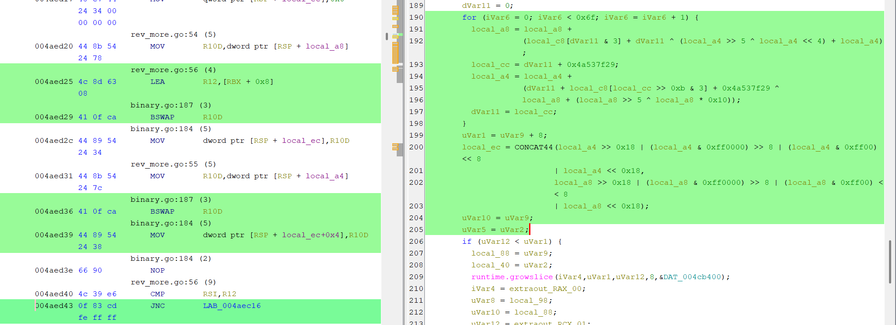


解密的时候把这个过程逆回去就可以（脚本使用了 AI 协助进行编写 qwq）。

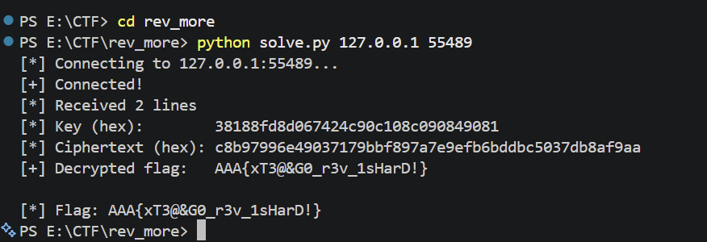

---

## Task 3 — rev_again


将文件放 Ghidra 里，看 Program Trees，发现 `UPX0`、`UPX1`。

!!! info "知识点：加壳"
    加壳是将可执行文件**压缩或加密**，运行时再自动解压还原。对逆向分析的影响是：直接用 Ghidra/IDA 打开加壳文件，只能看到壳的代码，看不到真正程序逻辑。

    **判断方法**：用 Ghidra 打开文件后，如果段名是 `UPX0`、`UPX1`（或 `UPX0`、`UPX1`、`UPX2`），说明被 UPX 加壳了。

    **脱壳方法**：用 UPX 工具直接解压：
    ```bash
    upx -d input.exe -o output.exe
    ```

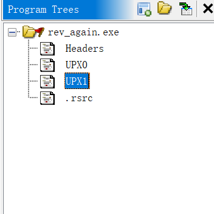  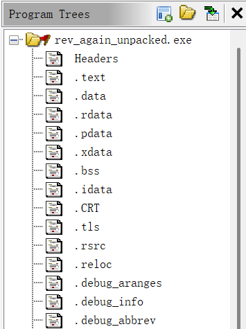


脱壳后可以看到文件的大体内容。一个 Windows `.exe` 文件主要包含以下几个关键部分：

| 结构 | 说明 |
|------|------|
| `.text` | 代码段，存放所有函数的机器码 |
| `.rdata` | 只读数据段，存放字符串、常量、加密数据等 |
| `.data` | 可读写数据段，存放全局变量 |
| 导入表 (IAT) | 列出程序调用的外部 DLL 函数（如 `MessageBoxW`） |
| 导出表 | 程序提供给外部的函数（`.exe` 通常没有） |


- **输入端**：明文 + 密钥（RVA `0x6020`，即 `kEy3rd`）
- **输出端**：密文
- **运算**：RC4 流加密（XOR）


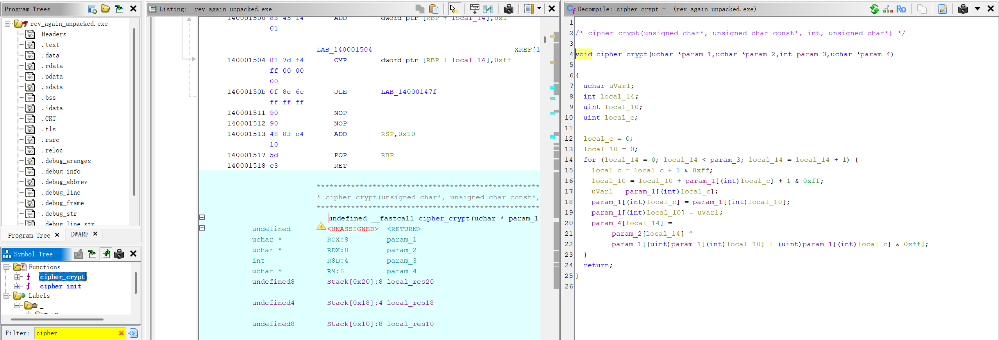


- **密钥**：用 String 搜索 `kEy3rd` 确定位置，然后 Search String 定位。

    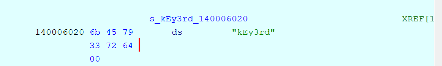

- **密文**：Ghidra Listing 窗口 `0x1400060e0` 处显示的数据（注意顶部 XREF 表明 `WindowProc` 函数两处引用了该地址），该地址到 `0x140006110` 之间即为加密后的 flag 密文。

    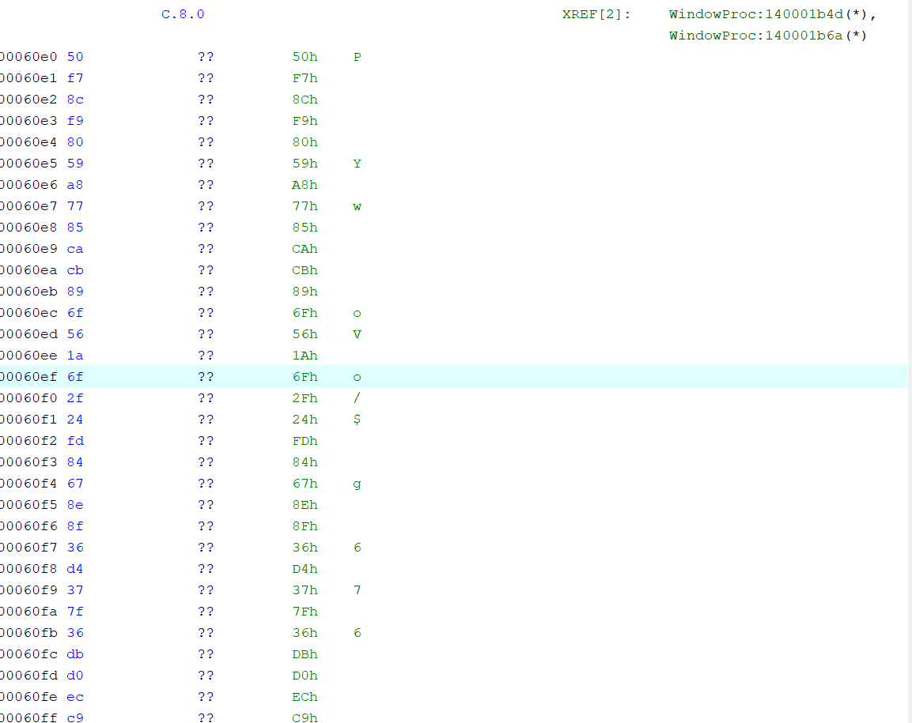


执行脚本后得到 flag。

> 偷偷补一个 `}` 应该没关系吧……我也不知道为什么不对。这道题基本从头到尾都是 AI 协助完成的，我改写不出来 orz。

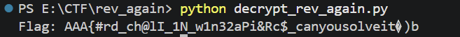
